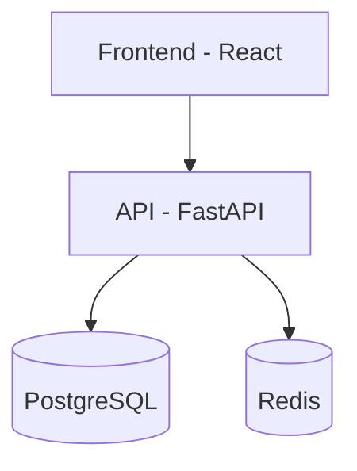
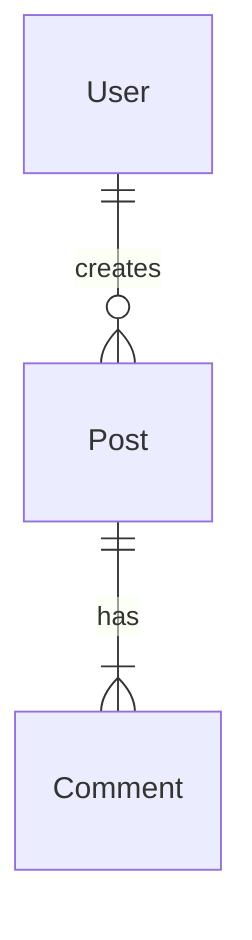
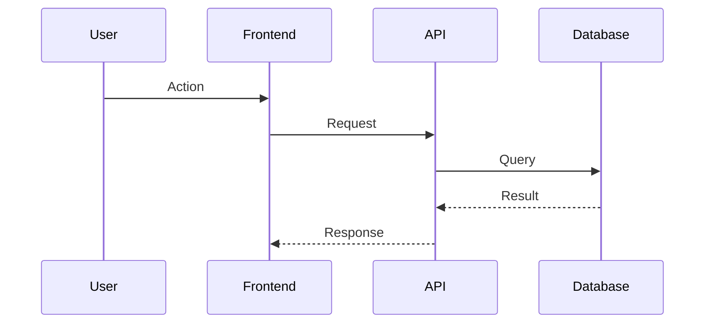

# Diagrams

Mermaid diagram standards for architecture and cloud documentation.

## Overview

| Doc | Diagram Types |
|-----|---------------|
| ARCHITECTURE.md | flowchart, erDiagram, sequenceDiagram |
| CLOUD.md | architecture-beta |

---

## ARCHITECTURE.md Diagrams

### 1. Architecture Flowchart

Shows system components and data flow.

**Include:** frontend, backend, database, external services, data flow

### 2. Data Model ERD

Shows entities and relationships.

**Include:** entities, relationships, key fields

### 3. Request Sequence

Shows typical user flows and interactions.

**Include:** typical user flow, key interactions

---

## CLOUD.md Diagrams

Use `architecture-beta` diagram type (Mermaid v11.1+) for cloud infrastructure. This provides purpose-built primitives for infrastructure visualization.

### 1. Infrastructure Diagram

Shows cloud services and their connections.

**Include:** VPCs, compute services, managed services, data stores, message queues

### 2. CI/CD Pipeline Diagram

Shows the deployment pipeline.

**Include:** source control, build system, artifact storage, deployment targets

---

## architecture-beta Syntax

| Construct | Purpose | Example |
|-----------|---------|---------|
| `group name(icon)[Label]` | Logical grouping (VPC, region) | `group vpc(cloud)[GCP VPC]` |
| `service name(icon)[Label]` | Service node | `service gke(logos:google-cloud)[GKE]` |
| `in groupname` | Place service in group | `service db(database)[CloudSQL] in vpc` |
| `node:SIDE -- SIDE:node` | Directional edge (L/R/T/B) | `gke:R -- L:pubsub` |
| `junction` | 4-way routing node | For complex topologies |

---

## Icon Packs

architecture-beta supports Iconify integration (200k+ icons):

| Pack | Use For | Example |
|------|---------|---------|
| `logos:google-cloud` | GCP services | `logos:google-cloud` |
| `logos:github` | GitHub | `logos:github` |
| `logos:docker` | Docker/containers | `logos:docker` |
| `database` | Generic database | `database` |
| `server` | Generic server | `server` |
| `cloud` | Generic cloud | `cloud` |

**Note**: GCP icon coverage in Iconify is limited. Use generic icons (`cloud`, `database`, `server`) when specific service icons unavailable.

---

## Diagram Rules

1. **No parentheses in mermaid node labels** - Use square brackets
2. **Keep focused and readable** - Don't overcrowd
3. **Label components clearly** - Use descriptive names
4. **Use architecture-beta for infrastructure** - In CLOUD.md
5. **Use flowchart/sequence/ERD for applications** - In ARCHITECTURE.md
6. **Edge directions** - L (left), R (right), T (top), B (bottom)

---

## When to Generate Diagrams

| Condition | Action |
|-----------|--------|
| `init` mode | Generate all relevant diagrams |
| `sync` mode + architecture changes | Regenerate diagrams |
| `diagrams` mode | Generate/update diagrams only |
| No services detected | Skip infrastructure diagram |
| No data models | Skip ERD |
