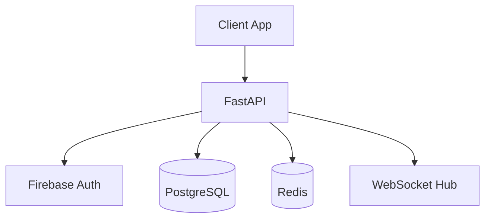

# Task Manager API

> A REST API for task management with user authentication and PostgreSQL storage.

Full-featured task management backend built with FastAPI, PostgreSQL, and Firebase Auth. Supports team workspaces, task assignments, and real-time updates via WebSockets.

## Table of Contents

### Quick Start
- [Overview](#overview)
- [Getting Started](#getting-started)
- [Configuration](#configuration)
- [Usage](#usage)

### Documentation
- [Architecture](./docs/ARCHITECTURE.md) - System design and data models
- [Environments](./docs/ENVIRONMENTS.md) - Setup and configuration
- [Cloud](./docs/CLOUD.md) - Infrastructure and deployment
- [Troubleshooting](./docs/TROUBLESHOOTING.md) - Common issues
- [Contributing](./docs/CONTRIBUTING.md) - Development workflow
- [Principles](./docs/PRINCIPLES.md) - Patterns and conventions

---

## Overview

Backend API for task management applications with team collaboration features.

| | |
|---|---|
| **Purpose** | Task management API with team workspaces |
| **Tech Stack** | FastAPI, PostgreSQL, Firebase Auth, Redis |
| **Audience** | Frontend developers, mobile app developers |

**Key Features:**
- User authentication via Firebase
- Team workspaces with role-based access
- Task CRUD with assignments and due dates
- Real-time updates via WebSockets
- PostgreSQL with async SQLAlchemy

---

## Getting Started

Set up the development environment with Docker for databases and local Python for the API.

**Prerequisites:** Python 3.12+, Docker, Firebase project

### 1. Install

```bash
make setup
```

### 2. Configure

```bash
cp .env.example .env
# Edit .env with your Firebase credentials
make db-start   # Start PostgreSQL and Redis via Docker
make migrate    # Run database migrations
```

### 3. Run

```bash
make run
```

**Local URLs:**
- **API:** http://localhost:8000
- **Docs:** http://localhost:8000/docs
- **WebSocket:** ws://localhost:8000/ws

> See [ENVIRONMENTS.md](./docs/ENVIRONMENTS.md) for detailed setup and configuration.

---

## Configuration

Environment variables control database connections, auth, and feature flags.

| Variable | Description | Required |
|----------|-------------|----------|
| `DATABASE_URL` | PostgreSQL connection string | Yes |
| `REDIS_URL` | Redis connection string | Yes |
| `FIREBASE_PROJECT_ID` | Firebase project for auth | Yes |
| `JWT_SECRET` | Secret for token signing | Yes |

> See [ENVIRONMENTS.md](./docs/ENVIRONMENTS.md) for full configuration options.

---

## Usage

All commands use make targets. API follows RESTful conventions.

| Command | Description |
|---------|-------------|
| `make setup` | Install dependencies and git hooks |
| `make run` | Start API server on port 8000 |
| `make db-start` | Start PostgreSQL and Redis containers |
| `make migrate` | Run database migrations |
| `make test` | Run pytest with coverage |
| `make lint` | Run ruff linter |
| `make deploy` | Deploy to Cloud Run |

---

## Architecture

FastAPI backend with PostgreSQL for data, Redis for caching/WebSockets, Firebase for auth.

| Component | Purpose |
|-----------|---------|
| `app/api/` | Route handlers and request/response models |
| `app/core/` | Auth, config, database connection |
| `app/models/` | SQLAlchemy ORM models |
| `app/services/` | Business logic layer |



> See [ARCHITECTURE.md](./docs/ARCHITECTURE.md) for full system design and data models.

---

## Testing

Tests use pytest with async support. Database tests use transactions that rollback.

```bash
make test
```

| Flag | Description |
|------|-------------|
| `-m "not slow"` | Skip slow integration tests |
| `-k "test_name"` | Run specific test |
| `--cov` | Generate coverage report |

> See [PRINCIPLES.md](./docs/PRINCIPLES.md) for testing patterns and approach.

---

## Deployment

Deploy to Google Cloud Run with automatic database migrations.

```bash
make deploy
```

> See [CLOUD.md](./docs/CLOUD.md) for infrastructure and deployment details.

---

## Troubleshooting

Common issues and quick fixes.

| Symptom | Quick Fix |
|---------|-----------|
| Database connection refused | Run `make db-start` |
| Auth token invalid | Check Firebase credentials in .env |
| Migration fails | Run `make db-reset` (dev only) |
| WebSocket disconnects | Check Redis is running |

> See [TROUBLESHOOTING.md](./docs/TROUBLESHOOTING.md) for full guide.

---

## Contributing

We welcome contributions. Please follow project conventions.

- Run `make lint` and `make test` before submitting
- Use conventional commit format: `feat:`, `fix:`, `docs:`
- Create feature branches from `main`

> See [CONTRIBUTING.md](./docs/CONTRIBUTING.md) for full workflow.
