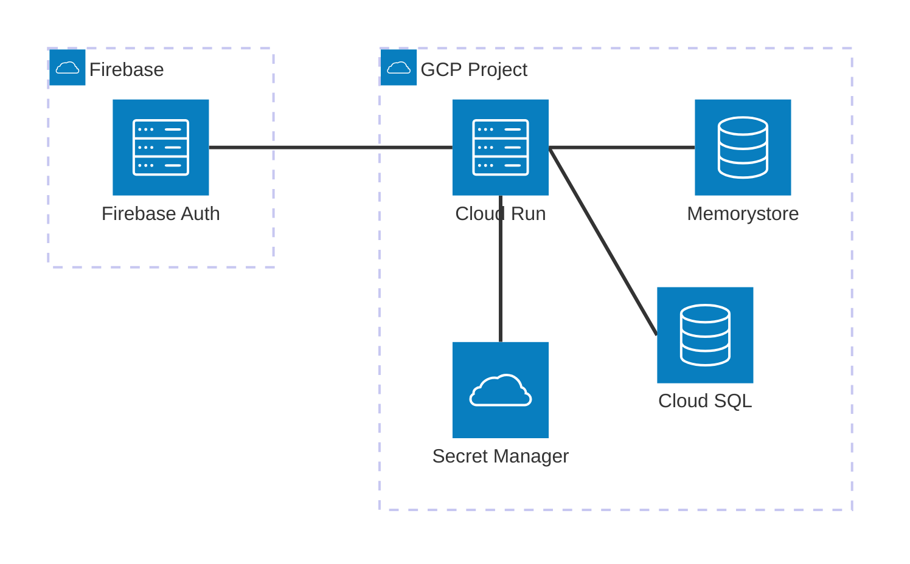

# Cloud Infrastructure

Cloud services, infrastructure setup, and deployment process.

---

## Overview

| Attribute | Value |
|-----------|-------|
| Provider | Google Cloud Platform |
| Project | task-manager-prod |
| Region | us-central1 |

---

## Services Used

| Service | Purpose | Notes |
|---------|---------|-------|
| Cloud Run | API hosting | Auto-scaling, serverless |
| Cloud SQL | PostgreSQL database | High availability |
| Memorystore | Redis cache | Managed Redis |
| Firebase Auth | User authentication | Free tier sufficient |
| Secret Manager | Secrets storage | Injected at runtime |
| Cloud Logging | Application logs | Automatic from Cloud Run |

---

## Infrastructure Diagram



---

## Deployment

### How to Deploy

```bash
make deploy           # Deploy to production
make deploy-staging   # Deploy to staging
```

### What Happens

1. Docker image built via Cloud Build
2. Image pushed to Artifact Registry
3. Cloud Run service updated
4. Traffic shifted to new revision
5. Database migrations run automatically

### Deploy Configuration

Deployment is configured in `cloudbuild.yaml`:

```yaml
steps:
  - name: 'gcr.io/cloud-builders/docker'
    args: ['build', '-t', 'IMAGE', '.']
  - name: 'gcr.io/cloud-builders/docker'
    args: ['push', 'IMAGE']
  - name: 'gcr.io/cloud-builders/gcloud'
    args: ['run', 'deploy', 'SERVICE', '--image', 'IMAGE']
```

### Rollback

```bash
# List revisions
gcloud run revisions list --service=task-manager

# Rollback to previous
gcloud run services update-traffic task-manager \
  --to-revisions=REVISION=100
```

---

## Monitoring

### Logs

View logs in Cloud Logging:

```bash
gcloud logging read "resource.type=cloud_run_revision" --limit=50
```

Or visit: [Cloud Logging Console](https://console.cloud.google.com/logs)

### Metrics

Cloud Run provides automatic metrics:
- Request count
- Request latency
- Container instance count
- Memory/CPU utilization

### Alerts

| Alert | Condition | Notification |
|-------|-----------|--------------|
| High error rate | >1% 5xx responses | Slack #alerts |
| High latency | p95 > 2s | Slack #alerts |
| Instance scaling | >10 instances | Email |

---

## Cost

| Service | Est. Monthly | Notes |
|---------|--------------|-------|
| Cloud Run | $50-200 | Based on traffic |
| Cloud SQL | $50 | Smallest instance |
| Memorystore | $30 | 1GB Redis |
| **Total** | ~$150 | Varies with usage |

---

## Access

### Getting GCP Access

1. Request access from project admin
2. Install gcloud CLI: `brew install google-cloud-sdk`
3. Authenticate: `gcloud auth login`
4. Set project: `gcloud config set project task-manager-prod`

### Required Permissions

| Role | Access |
|------|--------|
| Developer | Cloud Run Viewer, Logging Viewer |
| DevOps | Cloud Run Admin, Cloud SQL Admin |
| Admin | Project Owner |

---

## Operations

Basic operational procedures for the Task Manager API.

### Health Checks

| Service | Endpoint | Expected |
|---------|----------|----------|
| API | `GET /health` | `200 {"status": "healthy"}` |
| Database | Checked via API health | Connection pool active |
| Redis | Checked via API health | Connected |

```bash
# Quick health check
curl https://api.taskmanager.dev/health
```

### Scaling

Cloud Run auto-scales based on request volume. Manual scaling:

```bash
# Scale to minimum 2 instances (for warm starts)
gcloud run services update task-manager --min-instances=2

# Scale down for cost savings (dev only)
gcloud run services update task-manager --min-instances=0
```

### Restart Services

Cloud Run instances are stateless. To force a restart, deploy a new revision:

```bash
gcloud run services update task-manager --no-traffic
gcloud run services update-traffic task-manager --to-latest
```

### Quick Incident Response

| Severity | Response Time | Escalation |
|----------|---------------|------------|
| Critical (API down) | 15 min | Page on-call, notify #incidents |
| High (feature broken) | 1 hour | Slack #alerts |
| Medium (degraded) | 4 hours | Ticket |

**Common Issues:**

| Symptom | Quick Check | Resolution |
|---------|-------------|------------|
| 503 errors | Check Cloud Run logs | Scale up or check DB connection |
| High latency | Check Cloud SQL metrics | Add read replica or optimize queries |
| Auth failures | Check Firebase status | Verify service account key |

---

## Related Documentation

- [README.md](../README.md) - Project overview
- [ENVIRONMENTS.md](./ENVIRONMENTS.md) - Environment configuration
- [ARCHITECTURE.md](./ARCHITECTURE.md) - Application architecture
