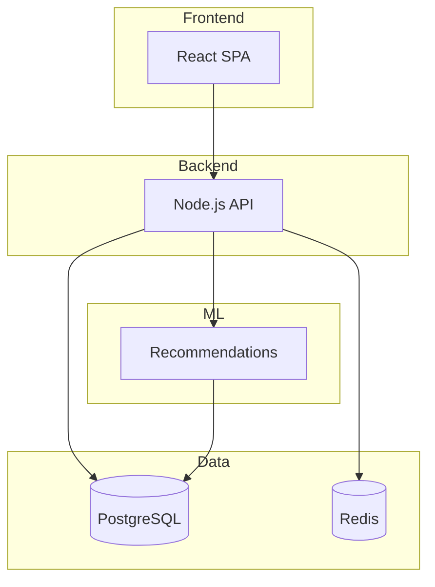

# E-Commerce Platform

> Full-stack e-commerce platform with React frontend, Node.js API, and Python recommendation service.

Multi-service monorepo for a complete e-commerce solution. Includes product catalog, user authentication, order management, and ML-powered recommendations.

## Table of Contents

### Quick Start
- [Overview](#overview)
- [Getting Started](#getting-started)
- [Configuration](#configuration)
- [Usage](#usage)

### Documentation
- [Architecture](./docs/ARCHITECTURE.md) - System design and service interactions
- [Environments](./docs/ENVIRONMENTS.md) - Setup and configuration
- [Cloud](./docs/CLOUD.md) - Infrastructure and deployment
- [Troubleshooting](./docs/TROUBLESHOOTING.md) - Common issues
- [Contributing](./docs/CONTRIBUTING.md) - Development workflow
- [Principles](./docs/PRINCIPLES.md) - Patterns and conventions

### Services
- [Frontend](./frontend/README.md) - React SPA
- [Backend](./backend/README.md) - Node.js API
- [Recommendations](./recommendations/README.md) - Python ML service

---

## Overview

Multi-service e-commerce platform built for scalability and maintainability.

| | |
|---|---|
| **Purpose** | Full-stack e-commerce with ML recommendations |
| **Tech Stack** | React, Node.js, Python, PostgreSQL, Redis, GCP |
| **Audience** | Platform developers and DevOps engineers |

**Key Features:**
- Product catalog with search and filtering
- User authentication and profiles
- Order management and checkout
- ML-powered product recommendations
- Infrastructure as Code with Terraform

---

## Getting Started

Set up all services locally with Docker for databases.

**Prerequisites:** Node.js 20+, Python 3.12+, Docker, pnpm

### 1. Install

```bash
pnpm install
```

### 2. Configure

```bash
cp .env.example .env.local
docker-compose up -d postgres redis
```

### 3. Run

```bash
pnpm dev
```

**Local URLs:**
- **Frontend:** http://localhost:3000
- **Backend API:** http://localhost:4000
- **Recommendations:** http://localhost:5000
- **API Docs:** http://localhost:4000/docs

> See [ENVIRONMENTS.md](./docs/ENVIRONMENTS.md) for detailed setup.

---

## Configuration

Environment variables are shared via root `.env.local` and service-specific overrides.

| Variable | Description | Required |
|----------|-------------|----------|
| `DATABASE_URL` | PostgreSQL connection | Yes |
| `REDIS_URL` | Redis connection | Yes |
| `JWT_SECRET` | Auth token signing | Yes |
| `ML_MODEL_PATH` | Recommendations model | Yes |

> See [ENVIRONMENTS.md](./docs/ENVIRONMENTS.md) for full configuration.

---

## Usage

Monorepo commands use pnpm workspaces.

| Command | Description |
|---------|-------------|
| `pnpm dev` | Start all services in development mode |
| `pnpm test` | Run all test suites |
| `pnpm build` | Build all services for production |
| `pnpm lint` | Run ESLint and Prettier checks |
| `pnpm typecheck` | Run TypeScript type checking |
| `pnpm --filter frontend dev` | Start frontend only |
| `pnpm --filter backend test` | Test backend only |
| `pnpm deploy:staging` | Deploy all services to staging |

---

## Architecture

Three-service architecture with shared packages and infrastructure as code.

| Service | Purpose | Port |
|---------|---------|------|
| [Frontend](./frontend/README.md) | React SPA | 3000 |
| [Backend](./backend/README.md) | REST API | 4000 |
| [Recommendations](./recommendations/README.md) | ML service | 5000 |



> See [ARCHITECTURE.md](./docs/ARCHITECTURE.md) for full system design.

---

## Testing

Each service has its own test suite. Run all or filter by service.

```bash
pnpm test
```

| Flag | Description |
|------|-------------|
| `--filter frontend` | Frontend tests only |
| `--filter backend` | Backend tests only |
| `--coverage` | Generate coverage report |

> See [PRINCIPLES.md](./docs/PRINCIPLES.md) for testing patterns.

---

## Deployment

Deploy all services to GCP Cloud Run via CI/CD.

```bash
pnpm deploy:staging
```

> See [CLOUD.md](./docs/CLOUD.md) for infrastructure details.

---

## Troubleshooting

| Symptom | Quick Fix |
|---------|-----------|
| Service won't start | Check Docker containers: `docker-compose ps` |
| Database connection | Run `docker-compose up -d postgres` |
| Port already in use | Kill process: `lsof -i :PORT` |
| pnpm install fails | Clear cache: `pnpm store prune` |

> See [TROUBLESHOOTING.md](./docs/TROUBLESHOOTING.md) for full guide.

---

## Contributing

All services share the same contribution workflow.

- Run `pnpm lint` and `pnpm test` before submitting
- Use conventional commits: `feat:`, `fix:`, `docs:`
- PRs require review from service owner

> See [CONTRIBUTING.md](./docs/CONTRIBUTING.md) for full workflow.

---

## 💡 Philosophy

**Monorepo for cohesion.** Shared code, atomic changes, consistent tooling. One PR can update frontend, backend, and types together.

**Services for scale.** Each service can deploy and scale independently. Teams own their services.

**Convention over configuration.** Shared ESLint, Prettier, TypeScript configs. Less decisions, more consistency.
