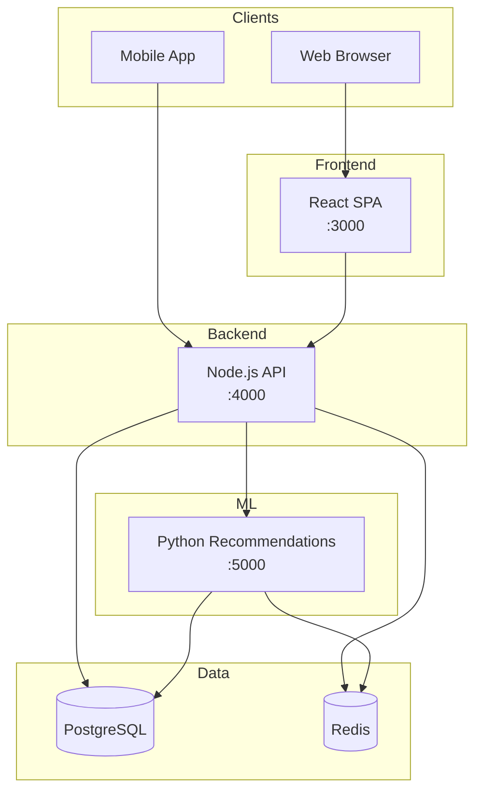
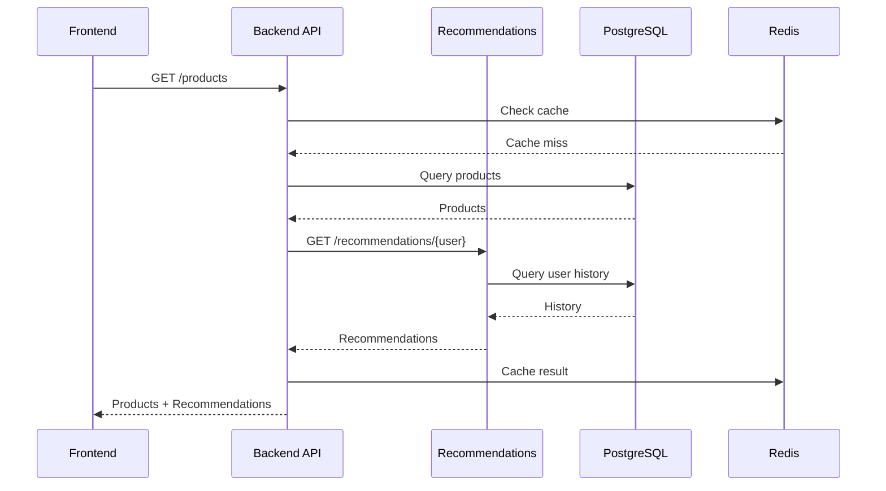

# Architecture

System design overview for the E-Commerce Platform.

## Table of Contents

### In This Document
- [Overview](#overview)
- [System Diagram](#system-diagram)
- [Key Components](#key-components)

### Detailed Documentation
- [Services](./architecture/SERVICES.md) - Service-by-service breakdown
- [Data Models](./architecture/DATA-MODELS.md) - Database schemas and ERDs

---

## Overview

Three-service architecture: React frontend, Node.js API, and Python ML service. Services communicate via REST, share a PostgreSQL database, and use Redis for caching and pub/sub.

| Attribute | Value |
|-----------|-------|
| Architecture Style | Microservices (3 services) |
| Communication | REST + Redis pub/sub |
| Database | PostgreSQL (shared) |
| Cache | Redis |

---

## System Diagram

---

## Key Components

| Component | Purpose | Port | Details |
|-----------|---------|------|---------|
| Frontend | React SPA, product browsing, checkout | 3000 | [Services →](./architecture/SERVICES.md#frontend) |
| Backend | REST API, auth, orders, inventory | 4000 | [Services →](./architecture/SERVICES.md#backend) |
| Recommendations | ML predictions, similar products | 5000 | [Services →](./architecture/SERVICES.md#recommendations) |
| PostgreSQL | Primary data store | 5432 | [Data Models →](./architecture/DATA-MODELS.md) |
| Redis | Cache, session, pub/sub | 6379 | - |

---

## Service Communication

---

## Shared Packages

| Package | Purpose | Used By |
|---------|---------|---------|
| `@ecom/types` | TypeScript types | Frontend, Backend |
| `@ecom/ui` | React components | Frontend |
| `@ecom/utils` | Utility functions | All services |

---

## Related Documentation

- [README.md](../README.md) - Project overview
- [PRINCIPLES.md](./PRINCIPLES.md) - Patterns and conventions
- [CLOUD.md](./CLOUD.md) - Infrastructure and deployment
