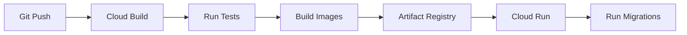

# Cloud Infrastructure

Infrastructure, deployment, and operations for the E-Commerce Platform.

---

## Overview

| Attribute | Value |
|-----------|-------|
| Provider | Google Cloud Platform |
| Project | ecom-platform-prod |
| Region | us-central1 |
| IaC | Terraform |

---

## Services Used

| Service | Purpose | Notes |
|---------|---------|-------|
| Cloud Run | Frontend, Backend, Recommendations | Auto-scaling containers |
| Cloud SQL | PostgreSQL database | High availability |
| Memorystore | Redis cache | Managed Redis |
| Cloud CDN | Static asset delivery | Frontend assets |
| Secret Manager | Secrets storage | Injected at runtime |
| Artifact Registry | Docker images | Private registry |
| Cloud Build | CI/CD | Triggered by GitHub |

---

## Infrastructure Diagram


---

## Deployment

### How to Deploy

```bash
# Deploy all services to staging
pnpm deploy:staging

# Deploy all services to production
pnpm deploy:prod

# Deploy single service
pnpm --filter backend deploy:prod
```

### What Happens

1. Cloud Build triggers on push to `main` (staging) or tag (prod)
2. Docker images built for each service
3. Images pushed to Artifact Registry
4. Cloud Run services updated
5. Database migrations run (backend only)
6. Traffic shifted to new revisions

### Rollback

```bash
# List revisions
gcloud run revisions list --service=backend

# Rollback to previous
gcloud run services update-traffic backend --to-revisions=REVISION=100
```

---

## CI/CD Pipeline



| Trigger | Environment | Branch/Tag |
|---------|-------------|------------|
| Push to `main` | Staging | `main` |
| Tag `v*` | Production | `v1.2.3` |
| Manual | Any | Via console |

---

## Monitoring

### Logs

```bash
# All services
gcloud logging read "resource.type=cloud_run_revision" --limit=50

# Specific service
gcloud logging read "resource.labels.service_name=backend" --limit=50
```

**Console:** [Cloud Logging](https://console.cloud.google.com/logs)

### Metrics

| Metric | Alert Threshold |
|--------|-----------------|
| Error rate | >1% 5xx for 5 min |
| Latency p95 | >2s for 5 min |
| Instance count | >20 instances |

### Dashboards

- [Service Overview](https://console.cloud.google.com/monitoring) - All services health
- [Cloud SQL](https://console.cloud.google.com/sql) - Database metrics

---

## Operations

### Health Checks

| Service | Endpoint | Expected |
|---------|----------|----------|
| Frontend | `GET /` | 200 |
| Backend | `GET /health` | 200 `{"status":"ok"}` |
| Recommendations | `GET /health` | 200 `{"status":"ok"}` |

### Scaling

Cloud Run auto-scales. For manual control:

```bash
# Minimum instances (warm starts)
gcloud run services update backend --min-instances=2

# Maximum instances (cost control)
gcloud run services update backend --max-instances=10
```

### Incident Response

| Severity | Response | Escalation |
|----------|----------|------------|
| P1 - Site down | 15 min | Page on-call |
| P2 - Feature broken | 1 hour | Slack #incidents |
| P3 - Degraded | 4 hours | Ticket |

**Common Issues:**

| Symptom | Check | Resolution |
|---------|-------|------------|
| 503 errors | Cloud Run logs | Scale up, check DB |
| Slow responses | Cloud SQL metrics | Add read replica |
| Auth failures | Secret Manager | Rotate credentials |

---

## Cost

| Service | Est. Monthly | Notes |
|---------|--------------|-------|
| Cloud Run (3 services) | $150-400 | Traffic dependent |
| Cloud SQL | $100 | HA instance |
| Memorystore | $50 | 2GB Redis |
| Cloud CDN | $20 | Bandwidth |
| **Total** | ~$350 | Varies with traffic |

---

## Access

### Getting Access

1. Request access from platform team
2. Install gcloud: `brew install google-cloud-sdk`
3. Authenticate: `gcloud auth login`
4. Set project: `gcloud config set project ecom-platform-prod`

### Permissions

| Role | Access |
|------|--------|
| Developer | Logs, metrics view |
| DevOps | Deploy, scale, secrets |
| Admin | Full project access |

---

## Related Documentation

- [README.md](../README.md) - Project overview
- [ARCHITECTURE.md](./ARCHITECTURE.md) - System architecture
- [CONTRIBUTING.md](./CONTRIBUTING.md) - Development workflow
