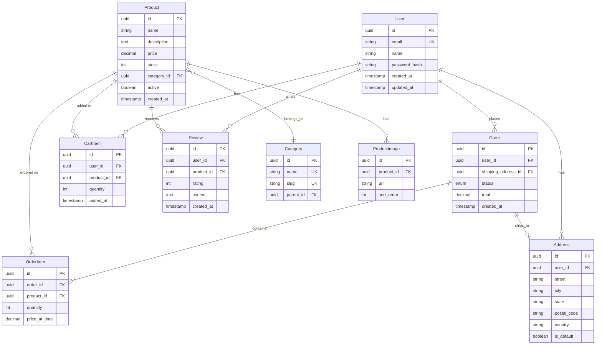

# Data Models

Database schemas and entity relationships for the E-Commerce Platform.

---

## Overview

PostgreSQL database with Prisma ORM. Single database shared across Backend and Recommendations services.

| Attribute | Value |
|-----------|-------|
| Database | PostgreSQL 15 |
| ORM | Prisma |
| Migrations | `pnpm --filter backend db:migrate` |

---

## Entity Relationship Diagram



---

## Tables

### Users

Core user account information.

| Column | Type | Constraints | Description |
|--------|------|-------------|-------------|
| id | uuid | PK | Unique identifier |
| email | varchar(255) | UK, NOT NULL | Login email |
| name | varchar(255) | NOT NULL | Display name |
| password_hash | varchar(255) | NOT NULL | Bcrypt hash |
| created_at | timestamp | NOT NULL | Registration date |
| updated_at | timestamp | NOT NULL | Last update |

**Indexes:**
- `users_email_key` (unique)

### Products

Product catalog.

| Column | Type | Constraints | Description |
|--------|------|-------------|-------------|
| id | uuid | PK | Unique identifier |
| name | varchar(255) | NOT NULL | Product name |
| description | text | | Full description |
| price | decimal(10,2) | NOT NULL | Current price |
| stock | int | NOT NULL, DEFAULT 0 | Available quantity |
| category_id | uuid | FK | Category reference |
| active | boolean | DEFAULT true | Visibility flag |
| created_at | timestamp | NOT NULL | Creation date |

**Indexes:**
- `products_category_id_idx`
- `products_active_idx`

### Orders

Customer orders.

| Column | Type | Constraints | Description |
|--------|------|-------------|-------------|
| id | uuid | PK | Unique identifier |
| user_id | uuid | FK, NOT NULL | Customer |
| shipping_address_id | uuid | FK | Delivery address |
| status | enum | NOT NULL | Order status |
| total | decimal(10,2) | NOT NULL | Order total |
| created_at | timestamp | NOT NULL | Order date |

**Status Values:**
- `pending` - Awaiting payment
- `paid` - Payment received
- `shipped` - In transit
- `delivered` - Complete
- `cancelled` - Cancelled

---

## Recommendations Data

The Recommendations service uses additional tables for ML features:

### user_product_interactions

Tracks user behavior for recommendations.

| Column | Type | Description |
|--------|------|-------------|
| user_id | uuid | User reference |
| product_id | uuid | Product reference |
| interaction_type | enum | view, cart, purchase |
| timestamp | timestamp | When it happened |

### product_embeddings

Pre-computed product vectors for similarity search.

| Column | Type | Description |
|--------|------|-------------|
| product_id | uuid | Product reference |
| embedding | vector(256) | Feature vector |
| updated_at | timestamp | Last computation |

---

## Migrations

```bash
# Create a new migration
pnpm --filter backend db:migrate:create add_reviews

# Apply migrations
pnpm --filter backend db:migrate

# Reset database (dev only)
pnpm --filter backend db:reset
```

---

## Related Documentation

- [ARCHITECTURE.md](../ARCHITECTURE.md) - System overview
- [SERVICES.md](./SERVICES.md) - Service details
