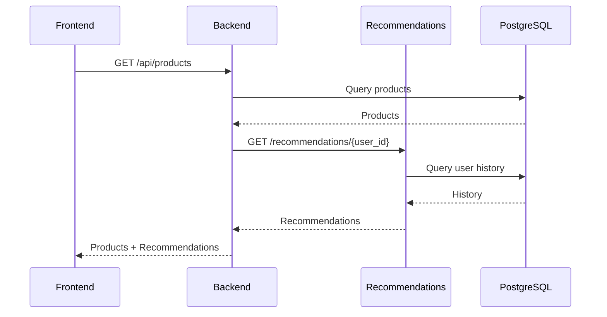

# Services

Detailed documentation for each service in the monorepo.

## Table of Contents

- [Overview](#overview)
- [Frontend](#frontend)
- [Backend](#backend)
- [Recommendations](#recommendations)
- [Shared Packages](#shared-packages)
- [Service Communication](#service-communication)

---

## Overview

The platform consists of three main services plus shared packages:

| Service | Technology | Responsibility |
|---------|------------|----------------|
| Frontend | React, TypeScript | User interface |
| Backend | Node.js, Express | Business logic, API |
| Recommendations | Python, FastAPI | ML predictions |

---

## Frontend

**Location:** `frontend/`

**Technology:** React 18, TypeScript, Vite, TailwindCSS

### Responsibilities
- Product browsing and search
- User authentication flows
- Shopping cart and checkout
- Order history

### Key Directories

| Directory | Purpose |
|-----------|---------|
| `src/components/` | Reusable UI components |
| `src/pages/` | Route-level components |
| `src/hooks/` | Custom React hooks |
| `src/api/` | Backend API clients |

### Commands

```bash
pnpm --filter frontend dev      # Development server
pnpm --filter frontend build    # Production build
pnpm --filter frontend test     # Run tests
```

> See [frontend/README.md](../../frontend/README.md) for details.

---

## Backend

**Location:** `backend/`

**Technology:** Node.js, Express, TypeScript, Prisma

### Responsibilities
- REST API for all operations
- Authentication and authorization
- Order processing
- Database operations

### Key Directories

| Directory | Purpose |
|-----------|---------|
| `src/routes/` | Express route handlers |
| `src/services/` | Business logic |
| `src/middleware/` | Auth, validation, logging |
| `src/prisma/` | Database schema and migrations |

### API Endpoints

| Endpoint | Method | Description |
|----------|--------|-------------|
| `/api/products` | GET | List products |
| `/api/products/:id` | GET | Get product |
| `/api/orders` | POST | Create order |
| `/api/users/me` | GET | Current user |

### Commands

```bash
pnpm --filter backend dev       # Development server
pnpm --filter backend migrate   # Run migrations
pnpm --filter backend test      # Run tests
```

> See [backend/README.md](../../backend/README.md) for details.

---

## Recommendations

**Location:** `recommendations/`

**Technology:** Python 3.12, FastAPI, scikit-learn

### Responsibilities
- Product recommendations
- Similar products
- Personalized rankings

### Key Directories

| Directory | Purpose |
|-----------|---------|
| `app/api/` | FastAPI endpoints |
| `app/models/` | ML model definitions |
| `app/services/` | Prediction logic |
| `data/` | Training data and models |

### API Endpoints

| Endpoint | Method | Description |
|----------|--------|-------------|
| `/recommendations/{user_id}` | GET | User recommendations |
| `/similar/{product_id}` | GET | Similar products |
| `/health` | GET | Health check |

### Commands

```bash
pnpm --filter recommendations dev    # Development server
pnpm --filter recommendations train  # Train model
pnpm --filter recommendations test   # Run tests
```

> See [recommendations/README.md](../../recommendations/README.md) for details.

---

## Shared Packages

**Location:** `packages/`

| Package | Purpose | Used By |
|---------|---------|---------|
| `@ecom/ui` | Shared UI components | Frontend |
| `@ecom/types` | TypeScript types | Frontend, Backend |
| `@ecom/utils` | Utility functions | All services |

### Using Shared Packages

```typescript
import { Button } from '@ecom/ui'
import { Product, Order } from '@ecom/types'
import { formatCurrency } from '@ecom/utils'
```

---

## Service Communication



### Internal Communication

| From | To | Method | Purpose |
|------|-----|--------|---------|
| Backend | Recommendations | HTTP | Get recommendations |
| Backend | Redis | TCP | Cache reads/writes |

---

## Related Documentation

- [Architecture Overview](../ARCHITECTURE.md)
- [Data Models](./DATA-MODELS.md)
