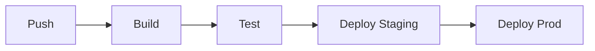

# Deployment

CI/CD pipelines, deployment processes, and release management.

## Table of Contents

- [Overview](#overview)
- [Environments](#environments)
- [CI/CD Pipeline](#cicd-pipeline)
- [Deployment Process](#deployment-process)
- [Rollback](#rollback)
- [Release Process](#release-process)

---

## Overview

[DEPLOYMENT_OVERVIEW]
<!-- Brief description of deployment strategy and targets -->

| Attribute | Value |
|-----------|-------|
| CI/CD Platform | [CICD_PLATFORM] |
| Deploy Target | [DEPLOY_TARGET] |
| Config Location | [CICD_CONFIG_PATH] |

---

## Environments

| Environment | URL | Branch | Auto-Deploy |
|-------------|-----|--------|-------------|
[ENVIRONMENTS_TABLE]

---

## CI/CD Pipeline

[PIPELINE_CONTEXT]
<!-- Brief explanation of the pipeline stages -->



### Pipeline Stages

| Stage | What Happens | Config |
|-------|--------------|--------|
[PIPELINE_STAGES_TABLE]

### Pipeline Configuration

```yaml
[PIPELINE_CONFIG_EXAMPLE]
```

---

## Deployment Process

### Deploy to Staging

```bash
[DEPLOY_STAGING_CMD]
```

**What happens:**
1. [STAGING_STEP_1]
2. [STAGING_STEP_2]
3. [STAGING_STEP_3]

### Deploy to Production

```bash
[DEPLOY_PROD_CMD]
```

**What happens:**
1. [PROD_STEP_1]
2. [PROD_STEP_2]
3. [PROD_STEP_3]

### Manual Deployment

[MANUAL_DEPLOY_CONTEXT]

```bash
[MANUAL_DEPLOY_COMMANDS]
```

---

## Rollback

### Quick Rollback

```bash
[QUICK_ROLLBACK_CMD]
```

### Full Rollback Procedure

1. [ROLLBACK_STEP_1]
2. [ROLLBACK_STEP_2]
3. [ROLLBACK_STEP_3]

### Rollback Checklist

- [ ] Identify the issue
- [ ] Notify team in [CHANNEL]
- [ ] Execute rollback
- [ ] Verify service health
- [ ] Post-mortem if needed

---

## Release Process

[RELEASE_CONTEXT]
<!-- How releases are versioned and managed -->

### Creating a Release

```bash
[RELEASE_COMMANDS]
```

### Version Format

[VERSION_FORMAT]
<!-- e.g., Semantic versioning: MAJOR.MINOR.PATCH -->

### Changelog

[CHANGELOG_PROCESS]
<!-- How changelog is maintained -->

---

## Related Documentation

- [Cloud Overview](../CLOUD.md)
- [Infrastructure](./INFRASTRUCTURE.md)
- [Monitoring](./MONITORING.md)
