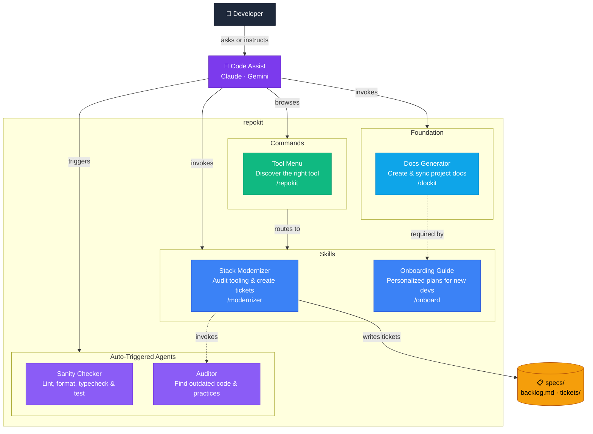
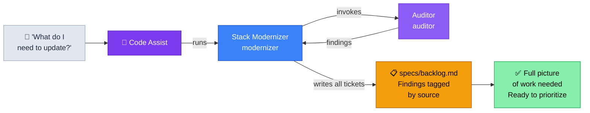

You are generating Mermaid diagrams for this repo — one architecture overview and three scenario flows showing real situations the toolkit handles. This repo ships as both a **Claude Code plugin** and a **Gemini CLI extension**.

## Platform Context

**Claude Code plugin** (`.claude-plugin/plugin.json`):
- Installed via `/plugin marketplace add` then `/plugin install`
- Skills invoked with plugin namespace: `/repokit:skill-name`
- Agents auto-trigger based on their `description` field
- Commands invoked as `/repokit:command-name`

**Gemini CLI extension** (`gemini-extension.json`):
- Installed via `gemini extensions install`
- Skills invoked without namespace: `/skill-name`
- Agents require opt-in (copy `agents/*.md` to `.gemini/agents/`)

---

## Step 1: Discover Distributed Components

Scan for **distributed** components only — exclude internal-only files in `.claude/` and `.gemini/`.

- **Skills:** Read each `SKILL.md` in `.agents/skills/*/SKILL.md`. Extract `name` and first sentence of `description`.
- **Agents:** Read each `.md` in `agents/`. Extract `name` and first sentence of `description`.
- **Commands:** Read each `.md` and `.toml` in `commands/`. Extract filename and `description`.

---

## Step 2: Architecture Overview Diagram

Build a `graph TD` diagram showing all components across both platforms.

### Node Labels

Use **human-friendly names** with a short description and the command hint on a third line:

```
S_dockit["Docs Generator\nCreate & sync project docs\n/repokit:dockit"]
```

Format: `"Friendly Name\nOne-line purpose\ncommand"`

### Colors

Apply these `classDef` styles and assign classes to every node:

```
classDef skill    fill:#3b82f6,stroke:#1d4ed8,color:#fff
classDef agent    fill:#8b5cf6,stroke:#6d28d9,color:#fff
classDef command  fill:#10b981,stroke:#059669,color:#fff
classDef storage  fill:#f59e0b,stroke:#b45309,color:#000
classDef platform fill:#f1f5f9,stroke:#94a3b8,color:#334155
classDef user     fill:#1e293b,stroke:#0f172a,color:#fff
```

- `skill` — all skill nodes (both Claude and Gemini)
- `agent` — all agent nodes (both Claude and Gemini)
- `command` — all command nodes
- `storage` — `Spec` node
- `user` — `User` node

### Structure

The diagram is **platform-unified** — all components are the same on Claude and Gemini. Do not duplicate them into separate subgraphs. Show platform invocation differences as a prose note beneath the diagram, not as separate boxes.

Show **dockit as foundational**: place it in its own `Foundation` subgroup with a distinct color, and draw dashed edges to the components that depend on it (`onboard` requires docs to exist; `auditor` is enriched by them).

The developer talks to the AI; the AI invokes the tools. The diagram must reflect this — add an `AI` node between the developer and all tools.



Add this note immediately after the diagram:

> **Claude Code:** skills invoked as `/repokit:skill-name` · **Gemini CLI:** invoked as `/skill-name`, agents require [opt-in setup](#gemini-subagents)

---

## Step 3: Scenario Flow Diagrams

Generate **three scenario diagrams** — one per major repokit use case. Each scenario has:
1. A **`###` title** naming the flow
2. A **one-sentence general description** of the class of problem (not tied to a specific repo or person)
3. A **`graph LR` diagram** using general node labels — no specific filenames or names, just roles and steps
4. A **"Example:" blockquote** below the diagram with one concrete, specific situation

Use the same `classDef` colors in every scenario diagram.

- The **first node** is a neutral, high-level scenario label — the general situation, no ❌. Style it `fill:#e2e8f0,stroke:#94a3b8,color:#1e293b`.
- The **last node** is the result. Style it `fill:#86efac,stroke:#16a34a,color:#000`.

Each scenario must show the **AI as orchestrator** between the developer and the tools. The developer never invokes tools directly — they ask a question or describe a situation, and the AI decides what to run.

Use these node styles for all scenario diagrams:
- `Dev` node: `fill:#1e293b,stroke:#0f172a,color:#fff`
- `CA` (Code Assist) node: `fill:#7c3aed,stroke:#5b21b6,color:#fff`
- `Scenario` (first/context node): `fill:#e2e8f0,stroke:#94a3b8,color:#1e293b`
- `Result` (last node): `fill:#86efac,stroke:#16a34a,color:#000`

### Scenario 1: Documentation on Demand

**General description:** *Repos of any size and age accumulate missing or nonexistent documentation — the codebase grows faster than anyone writes about it.*

```mermaid
graph LR
    Scenario["📁 Codebase\nwithout documentation"]
    Dev["👤 Developer"]
    CA["🤖 Code Assist"]
    Dockit["Docs Generator\ndockit init"]
    Output["📄 README · ARCHITECTURE\nENVIRONMENTS"]
    Result["✅ Docs created\nfrom the codebase\nin minutes"]

    Scenario --> Dev
    Dev -->|"'Set up docs\nfor this repo'"| CA
    CA -->|"invokes"| Dockit
    Dockit -->|"scans & generates"| Output
    Output --> Result

    classDef skill fill:#3b82f6,stroke:#1d4ed8,color:#fff
    classDef ai    fill:#7c3aed,stroke:#5b21b6,color:#fff
    class Dockit skill
    class CA ai
    style Scenario fill:#e2e8f0,stroke:#94a3b8,color:#1e293b
    style Dev      fill:#1e293b,stroke:#0f172a,color:#fff
    style Result   fill:#86efac,stroke:#16a34a,color:#000
```



> **Example:** An API service that's been running for two years has no README. A developer says "set up docs for this repo." The AI invokes dockit, which scans the codebase and generates a README, ARCHITECTURE, and ENVIRONMENTS doc in under a minute.

### Scenario 2: Quality Gates Before Code Ships

**General description:** *Code quality issues — lint errors, type failures, broken tests — are cheaper to catch locally than after a push triggers CI.*

```mermaid
graph LR
    Scenario["💻 Developer\nfinishes a feature"]
    Dev["👤 Developer"]
    CA["🤖 Code Assist"]
    Sanity["Sanity Checker\nauto-triggered agent"]
    Fix["🔧 Issues fixed\nlocally before commit"]
    Result["✅ Clean push\nCI passes first time"]

    Scenario --> Dev
    Dev -->|"'I just finished\nthe auth module'"| CA
    CA -->|"triggers"| Sanity
    Sanity -->|"fixes & reports"| Fix
    Fix --> Result

    classDef agent fill:#8b5cf6,stroke:#6d28d9,color:#fff
    classDef ai    fill:#7c3aed,stroke:#5b21b6,color:#fff
    class Sanity agent
    class CA ai
    style Scenario fill:#e2e8f0,stroke:#94a3b8,color:#1e293b
    style Dev      fill:#1e293b,stroke:#0f172a,color:#fff
    style Result   fill:#86efac,stroke:#16a34a,color:#000
```



> **Example:** A developer says "I just finished the auth module." The AI recognizes this as a completion signal and triggers the sanity-checker, which finds a missing type annotation and a failing unit test — before a single `git push`.

### Scenario 3: What Do I Need to Update?

**General description:** *A single question triggers an orchestrated review — the Code Assist runs modernizer, which internally invokes the auditor for doc health and audits tooling itself. Everything lands in a shared backlog.*



> **Example:** A developer asks "what do I need to update before the release?" The Code Assist runs modernizer. Modernizer invokes the auditor, which finds two setup commands in the README that no longer exist and a missing CI config. Modernizer finds no type checking configured and an outdated package manager. All findings land in `specs/backlog.md`, tagged by source.

---

## Step 4: Update README.md

1. Find (or create) a `## Component Diagram` section in `README.md`
2. Place it **before** `## Structure`
3. Replace it entirely if it already exists

Format each scenario with its `###` title, general description, diagram, and example blockquote:

```markdown
## Component Diagram

How repokit components connect across Claude and Gemini:

\`\`\`mermaid
[architecture overview diagram]
\`\`\`

### Scenario Flows

### Documentation on Demand

*Repos of any size and age accumulate missing or nonexistent documentation...*

\`\`\`mermaid
[scenario 1 diagram]
\`\`\`

> **Example:** An API service that's been running for two years...

### Quality Gates Before Code Ships

*Code quality issues are cheaper to catch locally than after a push...*

\`\`\`mermaid
[scenario 2 diagram]
\`\`\`

> **Example:** A developer wraps up an auth refactor...

### Making Tech Debt Visible

*Technical debt and outdated tooling accumulate silently...*

\`\`\`mermaid
[scenario 3 diagram]
\`\`\`

> **Example:** A team lead asks "what's the state of our tooling?"...

---
```

---

## Step 5: Report

After updating README.md, report:
- Components found: X skills, Y agents, Z commands
- Diagram section: inserted or updated
- Scenarios generated: list the three titles
- Any components skipped and why
