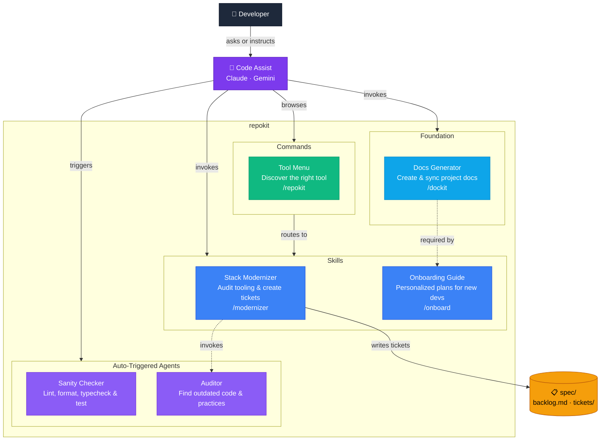
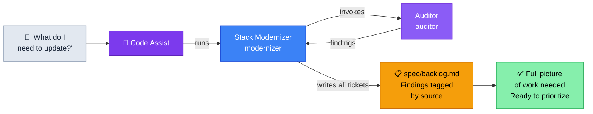

# repokit

A codebase maintenance toolkit for AI agents. Provides skills, agents, commands, hooks, and policies that help development teams maintain documentation, modernize tooling, onboard developers, and track technical debt.

## Install

**Claude Code plugin:**
```bash
/plugin marketplace add TheLampshady/repokit
/plugin install repokit@repokit-marketplace
```

**Gemini CLI extension:**
```bash
gemini extensions install https://github.com/TheLampshady/repokit
```

**GitHub Copilot CLI plugin:**
```bash
copilot plugin install https://github.com/TheLampshady/repokit
```

---

## Tools

### Skills (cross-platform: Claude + Gemini)

| Skill | Command | Purpose |
|-------|---------|---------|
| **dockit** | `/dockit` | Generate, sync, check, and migrate project documentation. Scales by project size, auto-detects frameworks. |
| **modernizer** | `/modernizer` | Audit the codebase for outdated tooling, missing tests, and packaging gaps. Creates tickets in `spec/`. |
| **onboard** | `/onboard` | Create personalized onboarding plans for new team members based on role or feature focus. |

### Agents (auto-triggered)

| Agent | Triggers when... | Platform |
|-------|-----------------|----------|
| **sanity-checker** | You need to verify code quality, before committing, after fixing a bug | Claude |
| **auditor** | You ask to review the codebase for outdated code, stale practices, or automation gaps | Claude |

> **Gemini users:** See [Enabling Gemini Subagents](#gemini-subagents) to use agents on Gemini.

### Commands

| Command | Purpose |
|---------|---------|
| `/repokit` | Show the full tool menu and get guided to the right tool |

---

## Ticket System

All tools write work items to a shared backlog under `spec/`:

```
spec/
├── backlog.md       ← master checklist, items tagged by source
└── tickets/
    ├── 001-add-tests.md
    └── 002-stale-setup-docs.md
```

Tags in `backlog.md` show which tool created each item: `[modernizer]`, `[sanity-checker]`, `[manual]`. (The auditor does not write tickets directly — its findings flow through modernizer.)

---

## Keeping Docs in Sync

After making code changes, run dockit to check for documentation drift:

- `/repokit:dockit check` — detect stale docs (read-only, exit codes)
- `/repokit:dockit sync` — auto-update stale sections (non-destructive)

Run `check` before releases or PRs. Run `sync` when docs fall behind.

---

## Gemini Subagents

Repokit agent definitions are compatible with Gemini's experimental subagent system.

**1. Enable subagents** in `.gemini/settings.json` or `~/.gemini/settings.json`:

```json
{
  "experimental": {
    "enableAgents": true
  }
}
```

**2. Copy agent definitions:**

```bash
# Project-level (team-shared)
mkdir -p .gemini/agents
cp agents/*.md .gemini/agents/

# Or user-level (all your projects)
mkdir -p ~/.gemini/agents
cp agents/*.md ~/.gemini/agents/
```

**3. Restart Gemini CLI.**

> Subagents run in YOLO mode — they execute tool calls without per-step confirmation. Review `agents/*.md` before enabling.

---

## Component Diagram



> **Claude Code:** skills invoked as `/repokit:skill-name` · **Gemini CLI:** invoked as `/skill-name`, agents require [opt-in setup](#gemini-subagents)

### Scenario Flows

#### Documentation on Demand

*Repos of any size and age accumulate missing or nonexistent documentation — the codebase grows faster than anyone writes about it.*

```mermaid
graph LR
    Scenario["📁 Codebase\nwithout documentation"]
    Dev["👤 Developer"]
    CA["🤖 Code Assist"]
    Dockit["Docs Generator\ndockit init"]
    Output["📄 README · ARCHITECTURE\nENVIRONMENTS"]
    Result["✅ Docs created\nfrom the codebase\nin minutes"]

    Scenario --> Dev
    Dev -->|"'Set up docs\nfor this repo'"| CA
    CA -->|"invokes"| Dockit
    Dockit -->|"scans & generates"| Output
    Output --> Result

    classDef skill fill:#3b82f6,stroke:#1d4ed8,color:#fff
    classDef ai    fill:#7c3aed,stroke:#5b21b6,color:#fff
    class Dockit skill
    class CA ai
    style Scenario fill:#e2e8f0,stroke:#94a3b8,color:#1e293b
    style Dev      fill:#1e293b,stroke:#0f172a,color:#fff
    style Result   fill:#86efac,stroke:#16a34a,color:#000
```



> **Example:** An API service that's been running for two years has no README. A developer says "set up docs for this repo." The Code Assist invokes dockit, which scans the codebase and generates a README, ARCHITECTURE, and ENVIRONMENTS doc in under a minute.

#### Quality Gates Before Code Ships

*Code quality issues — lint errors, type failures, broken tests — are cheaper to catch locally than after a push triggers CI.*

```mermaid
graph LR
    Scenario["💻 Developer\nfinishes a feature"]
    Dev["👤 Developer"]
    CA["🤖 Code Assist"]
    Sanity["Sanity Checker\nauto-triggered agent"]
    Fix["🔧 Issues fixed\nlocally before commit"]
    Result["✅ Clean push\nCI passes first time"]

    Scenario --> Dev
    Dev -->|"'I just finished\nthe auth module'"| CA
    CA -->|"triggers"| Sanity
    Sanity -->|"fixes & reports"| Fix
    Fix --> Result

    classDef agent fill:#8b5cf6,stroke:#6d28d9,color:#fff
    classDef ai    fill:#7c3aed,stroke:#5b21b6,color:#fff
    class Sanity agent
    class CA ai
    style Scenario fill:#e2e8f0,stroke:#94a3b8,color:#1e293b
    style Dev      fill:#1e293b,stroke:#0f172a,color:#fff
    style Result   fill:#86efac,stroke:#16a34a,color:#000
```



> **Example:** A developer says "I just finished the auth module." The Code Assist recognizes this as a completion signal and triggers the sanity-checker, which finds a missing type annotation and a failing unit test — before a single `git push`.

#### What Do I Need to Update?

*A single question triggers an orchestrated review — the Code Assist runs modernizer, which internally invokes the auditor to find outdated code, stale practices, and automation gaps. Modernizer takes the auditor's findings, combines them with its own tooling analysis, and writes all tickets to a shared backlog.*



> **Example:** A developer asks "what do I need to update before the release?" The Code Assist runs modernizer. Modernizer invokes the auditor, which finds two setup commands in the README that no longer exist and a missing CI config. Modernizer finds no type checking configured and an outdated package manager. All findings land in `spec/backlog.md`, tagged by source.

---

## Structure

```
repokit/
├── .agents/skills/          ← cross-platform skills (Claude + Gemini)
│   ├── dockit/
│   ├── modernizer/
│   └── onboard/
├── agents/                  ← distributed agents (sanity-checker, auditor)
├── .claude/agents/          ← internal dev tools (component-reviewer)
├── .claude-plugin/          ← Claude plugin + marketplace metadata
├── commands/                ← slash commands (/repokit menu)
├── hooks/                   ← session lifecycle hooks
├── policies/                ← Gemini policy engine rules
├── spec/                    ← ticket system
│   ├── backlog.md
│   └── tickets/
├── CLAUDE.md                ← Claude context
├── GEMINI.md                ← Gemini context + subagent setup
└── gemini-extension.json    ← Gemini extension manifest
```

---

## Policies

The Gemini extension includes security policies (`policies/policies.toml`):

- Requires confirmation before `rm -rf` commands
- Blocks grep searches for sensitive files (`.env`, `id_rsa`, `passwd`)
- Validates file paths on write operations

---
