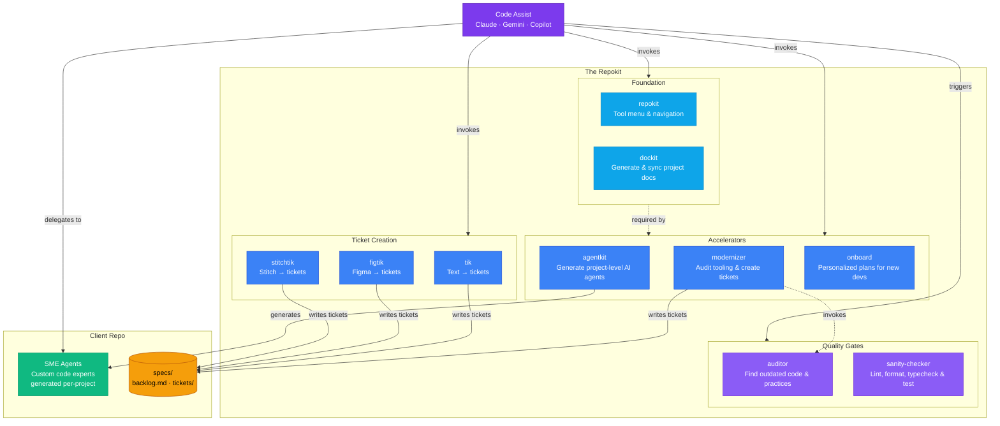
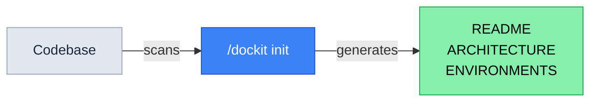
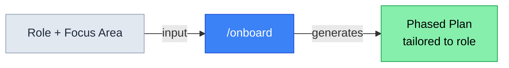
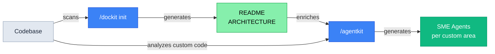
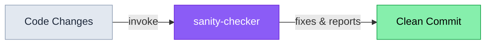
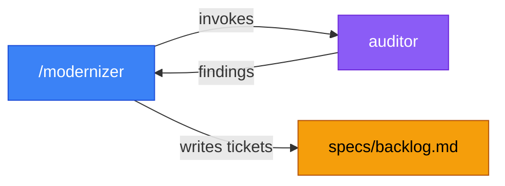
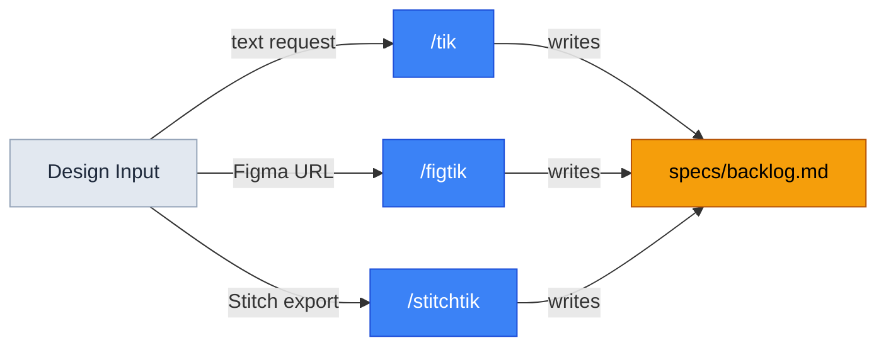

# repokit

A codebase maintenance toolkit for AI agents. Works with **Claude Code**, **Gemini CLI**, and **GitHub Copilot CLI**. Provides skills, agents, hooks, and policies that help development teams maintain documentation, modernize tooling, onboard developers, and track technical debt.

## Install

**Claude Code plugin:**
```bash
claude plugin marketplace add TheLampshady/repokit
claude plugin install repokit@repokit-marketplace
```


**Gemini CLI extension:**
```bash
gemini extensions install https://github.com/TheLampshady/repokit
```

**GitHub Copilot CLI plugin:**
```bash
copilot plugin install https://github.com/TheLampshady/repokit
```


### Update

**Claude Code plugin:**
```bash
claude plugin marketplace update repokit-marketplace
```

**Gemini CLI extension:**
```bash
gemini extensions update repokit
```

**GitHub Copilot CLI plugin:**
```bash
copilot plugin update repokit
```

### Un-Install

**Claude Code plugin:**
```bash
claude plugin marketplace remove TheLampshady/repokit
claude plugin uninstall repokit@repokit-marketplace
```

**Gemini CLI extension:**
```bash
gemini extensions uninstall https://github.com/TheLampshady/repokit
```

**GitHub Copilot CLI plugin:**
```bash
copilot plugin uninstall https://github.com/TheLampshady/repokit
```

---

## Tools

### Skills (cross-platform: Claude + Gemini + Copilot)

| Skill | Command | Purpose | Status |
|-------|---------|---------|--------|
| **agentkit** | `/agentkit` | Generate project-level AI agents tailored to your codebase's custom code patterns. Supports Claude, Gemini, and Copilot. | WIP |
| **dockit** | `/dockit` | Generate, sync, check, and migrate project documentation. Scales by project size, auto-detects frameworks. | Ready |
| **figtik** | `/figtik` | Turn Figma designs into structured implementation tickets. Fetches design data via API, compares against codebase. | Ready |
| **modernizer** | `/modernizer` | Audit the codebase for outdated tooling, missing tests, and packaging gaps. Creates tickets in `specs/`. | In Review |
| **onboard** | `/onboard` | Create personalized onboarding plans for new team members based on role or feature focus. | Ready |
| **repokit** | `/repokit` | Show the full tool menu and get guided to the right tool. | In Review |
| **stitchtik** | `/stitchtik` | Turn Google Stitch UI exports into structured implementation tickets. Compares mockups against codebase. | Ready |
| **tik** | `/tik` | Default ticket creation — turn text requests into structured, well-written tickets. | Ready |

### Agents

| Agent | Use when... | Platform |
|-------|------------|----------|
| **sanity-checker** | Verifying code quality, before committing, after fixing a bug | Claude |
| **auditor** | Reviewing the codebase for outdated code, stale practices, or automation gaps | Claude |

> **Gemini users:** See [Enabling Gemini Subagents](#gemini-subagents) to use agents on Gemini.

---

## Ticket System

All tools write work items to a shared backlog under `specs/`:

```
specs/
├── backlog.md       ← master checklist, items tagged by source
└── tickets/
    ├── 001-add-tests.md
    └── 002-stale-setup-docs.md
```

Tags in `backlog.md` show which tool created each item: `[tik]`, `[figtik]`, `[stitchtik]`, `[modernizer]`, `[sanity-checker]`, `[manual]`. (The auditor does not write tickets directly — its findings flow through modernizer.)

---

## Keeping Docs in Sync

After making code changes, run dockit to check for documentation drift:

- `/repokit:dockit check` — detect stale docs (read-only, exit codes)
- `/repokit:dockit sync` — auto-update stale sections (non-destructive)

Run `check` before releases or PRs. Run `sync` when docs fall behind.

---

## Context7 (Library Documentation)

Repokit's agentkit skill uses [Context7](https://github.com/upstash/context7) to fetch up-to-date framework documentation when analyzing your codebase. No API key required.

**Claude Code & Copilot CLI** — bundled automatically via `.mcp.json`. Context7 starts when the plugin is installed.

**Gemini CLI** — add to your `~/.gemini/settings.json`:

```json
{
  "mcpServers": {
    "context7": {
      "type": "http",
      "url": "https://mcp.context7.com/mcp"
    }
  }
}
```

> For higher rate limits or private repo access, get a free API key at [context7.com/dashboard](https://context7.com/dashboard) and set `CONTEXT7_API_KEY` in your environment.

---

## Gemini Subagents

Repokit agent definitions are compatible with Gemini's experimental subagent system.

**1. Enable subagents** in `.gemini/settings.json` or `~/.gemini/settings.json`:

```json
{
  "experimental": {
    "enableAgents": true
  }
}
```

**2. Copy agent definitions:**

```bash
# Project-level (team-shared)
mkdir -p .gemini/agents
cp agents/*.md .gemini/agents/

# Or user-level (all your projects)
mkdir -p ~/.gemini/agents
cp agents/*.md ~/.gemini/agents/
```

**3. Restart Gemini CLI.**

> Subagents run in YOLO mode — they execute tool calls without per-step confirmation. Review `agents/*.md` before enabling.

---

## Component Diagram



> **Claude Code:** skills invoked as `/repokit:skill-name` · **Gemini CLI / Copilot CLI:** invoked as `/skill-name`, agents require [opt-in setup](#gemini-subagents)

### Scenario Flows

#### Documentation on Demand



> Scans the codebase and generates docs from what's there. Run once to bootstrap, then `/dockit sync` to keep them current.

#### Onboarding a New Developer



> Reads existing docs and codebase, asks for role, builds a personalized ramp-up plan.

#### Generate SME Agents



> Recommended flow: `/dockit init` first to generate project docs, then `/agentkit` uses those docs as architecture context when building agents. Agents are scaled to project size and generated for Claude/Gemini/Copilot.

#### Quality Gates



> Lint, format, typecheck, test — catches issues before they hit CI.

#### Stack Modernization



> Audits tooling, finds outdated code and practices, writes prioritized tickets to a shared backlog.

#### Design-to-Ticket Pipeline



> Three paths to the same backlog. `tik` for text requests, `figtik` for Figma designs, `stitchtik` for Google Stitch exports. All compare against the existing codebase before writing tickets.

---

## Structure

```
repokit/
├── skills/                  ← cross-platform skills (Claude + Gemini + Copilot)
│   ├── agentkit/
│   ├── dockit/
│   ├── figtik/
│   ├── modernizer/
│   ├── onboard/
│   ├── repokit/
│   ├── stitchtik/
│   └── tik/
├── .agents/skills → skills/  ← symlink for Gemini (git clone resolves it)
├── agents/                  ← distributed agents (sanity-checker, auditor)
├── .claude/agents/          ← internal dev tools (component-reviewer)
├── .claude-plugin/          ← Claude plugin + marketplace metadata
├── hooks/                   ← session lifecycle hooks
├── policies/                ← Gemini policy engine rules
├── specs/                    ← ticket system
│   ├── backlog.md
│   └── tickets/
├── CLAUDE.md                ← Claude context
├── GEMINI.md                ← Gemini context + subagent setup
└── gemini-extension.json    ← Gemini extension manifest
```

---

## Policies

The Gemini extension includes security policies (`policies/policies.toml`):

- Requires confirmation before `rm -rf` commands
- Blocks grep searches for sensitive files (`.env`, `id_rsa`, `passwd`)
- Validates file paths on write operations

---

## Report an Issue

Found a bug or unexpected behavior with a skill or agent? [Open an issue](https://github.com/TheLampshady/repokit/issues/new?template=ai-skills.yml).

Include which component (skill/agent), AI platform, and what you asked vs. what happened.

---
