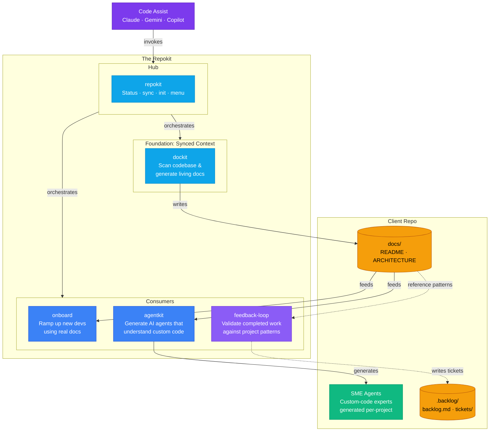
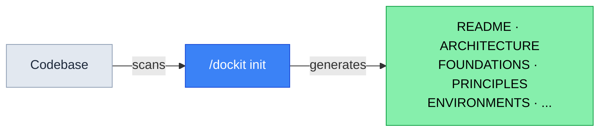
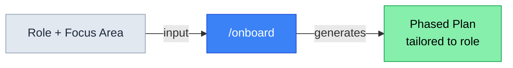
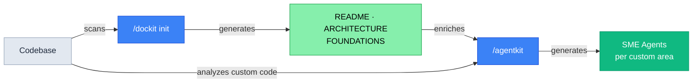
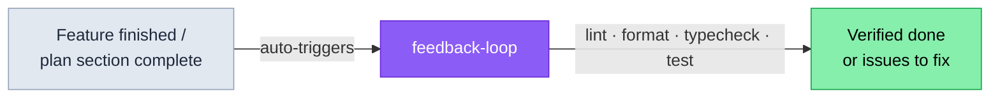

# repokit

**Keep your project's context in sync, then put it to work.**

Repokit treats your codebase's documentation as living context. `dockit` scans the project and keeps docs aligned with the code as it changes. That synced context then powers three consumers:

- **`onboard`** — ramps up new developers with plans grounded in the project's actual structure and conventions
- **`feedback-loop`** — validates that completed work is correctly implemented against the project's real patterns
- **`agentkit`** — generates project-specific AI agents that understand your custom code and foundations

The `/repokit` hub orchestrates the loop. Works with **Claude Code**, **Gemini CLI**, and **GitHub Copilot CLI**.

> **Sibling plugin:** ticket creation lives in [tikkit](https://github.com/TheLampshady/tikkit) — `/tik`, `/figtik`, `/stitchtik`, `/modernizer`. Both plugins write to the same `.backlog/backlog.md` and can be installed together.

## Install

**Claude Code plugin:**
```bash
claude plugin marketplace add TheLampshady/repokit
claude plugin install repokit@repokit-marketplace
```


**Gemini CLI extension:**
```bash
gemini extensions install https://github.com/TheLampshady/repokit
```

**GitHub Copilot CLI plugin:**
```bash
copilot plugin install https://github.com/TheLampshady/repokit
```


### Update

**Claude Code plugin:**
```bash
claude plugin marketplace update repokit-marketplace
```

**Gemini CLI extension:**
```bash
gemini extensions update repokit
```

**GitHub Copilot CLI plugin:**
```bash
copilot plugin update repokit
```

### Un-Install

**Claude Code plugin:**
```bash
claude plugin marketplace remove TheLampshady/repokit
claude plugin uninstall repokit@repokit-marketplace
```

**Gemini CLI extension:**
```bash
gemini extensions uninstall https://github.com/TheLampshady/repokit
```

**GitHub Copilot CLI plugin:**
```bash
copilot plugin uninstall https://github.com/TheLampshady/repokit
```

---

## Tools

### Skills (cross-platform: Claude + Gemini + Copilot)

| Skill | Command | Purpose | Status |
|-------|---------|---------|--------|
| **agentkit** | `/agentkit` | Generate project-level AI agents tailored to your codebase's custom code patterns. Supports Claude, Gemini, and Copilot. | WIP |
| **dockit** | `/dockit` | Generate, sync, check, audit, migrate, and refresh diagrams in project documentation. Scales by project size, auto-detects frameworks. | Ready |
| **onboard** | `/onboard` | Create personalized onboarding plans for new team members based on role or feature focus. | Ready |
| **repokit** | `/repokit` | Show the full tool menu and get guided to the right tool. | Ready |

### Agents

| Agent | Use when... | Platform |
|-------|------------|----------|
| **feedback-loop** | A feature is finished or a major plan section is complete, and you want to verify it's correctly implemented | Claude |

> **Gemini users:** See [Enabling Gemini Subagents](#gemini-subagents) to use agents on Gemini.

---

## Ticket System

Repokit consumes (and contributes to) a shared backlog under `.backlog/`:

```
.backlog/
├── backlog.md       ← master checklist, items tagged by source
└── tickets/
    ├── add-tests.md
    └── stale-setup-docs.md
```

Tags from repokit: `[feedback-loop]`. If [tikkit](https://github.com/TheLampshady/tikkit) is also installed, it adds `[tik]`, `[figtik]`, `[stitchtik]`, `[modernizer]` to the same file. Format is identical across both plugins.

---

## Keeping Docs in Sync

After making code changes, run dockit to check for documentation drift:

- `/repokit:dockit check` — detect stale docs (read-only, exit codes)
- `/repokit:dockit sync` — auto-update stale sections (non-destructive)

Run `check` before releases or PRs. Run `sync` when docs fall behind.

---

## Context7 (Library Documentation)

Repokit's agentkit skill uses [Context7](https://github.com/upstash/context7) to fetch up-to-date framework documentation when analyzing your codebase. No API key required.

**Claude Code & Copilot CLI** — bundled automatically via `.mcp.json`. Context7 starts when the plugin is installed.

**Gemini CLI** — add to your `~/.gemini/settings.json`:

```json
{
  "mcpServers": {
    "context7": {
      "type": "http",
      "url": "https://mcp.context7.com/mcp"
    }
  }
}
```

> For higher rate limits or private repo access, get a free API key at [context7.com/dashboard](https://context7.com/dashboard) and set `CONTEXT7_API_KEY` in your environment.

---

## Gemini Subagents

Repokit agent definitions are compatible with Gemini's experimental subagent system.

**1. Enable subagents** in `.gemini/settings.json` or `~/.gemini/settings.json`:

```json
{
  "experimental": {
    "enableAgents": true
  }
}
```

**2. Copy agent definitions:**

```bash
# Project-level (team-shared)
mkdir -p .gemini/agents
cp agents/*.md .gemini/agents/

# Or user-level (all your projects)
mkdir -p ~/.gemini/agents
cp agents/*.md ~/.gemini/agents/
```

**3. Restart Gemini CLI.**

> Subagents run in YOLO mode — they execute tool calls without per-step confirmation. Review `agents/*.md` before enabling.

---

## Component Diagram



> The architecture is one foundation feeding three consumers. dockit produces synced context; onboard, feedback-loop, and agentkit each put that context to work in different ways.

> **Claude Code:** skills invoked as `/repokit:skill-name` · **Gemini CLI / Copilot CLI:** invoked as `/skill-name`, agents require [opt-in setup](#gemini-subagents)

### Scenario Flows

#### Documentation on Demand



> Scans the codebase and generates docs from what's there — including a `FOUNDATIONS.md` catalog of shared/foundational code, detected by fan-in × cross-feature × stability scoring. Run once to bootstrap, then `/dockit sync` to keep everything current.

#### Onboarding a New Developer



> Reads existing docs and codebase, asks for role, builds a personalized ramp-up plan.

#### Generate SME Agents



> Recommended flow: `/dockit init` first to generate project docs (including `FOUNDATIONS.md` — the catalog of shared/foundational code), then `/agentkit` uses those docs as architecture context when building agents. Agents are scaled to project size and generated for Claude/Gemini/Copilot.

#### Feedback at Completion



> When a feature or major plan section wraps up, the agent runs the project's lint/format/typecheck/test commands to confirm the work is correctly implemented before it's declared done.

---

## Structure

```
repokit/
├── skills/                  ← cross-platform skills (Claude + Gemini + Copilot)
│   ├── agentkit/
│   ├── dockit/
│   ├── onboard/
│   └── repokit/
├── agents/                  ← distributed agents (feedback-loop)
├── .claude/agents/          ← internal dev tools (component-reviewer)
├── .claude-plugin/          ← Claude plugin + marketplace metadata
├── policies/                ← Gemini policy engine rules
├── CLAUDE.md                ← Claude context
├── GEMINI.md                ← Gemini context + subagent setup
└── gemini-extension.json    ← Gemini extension manifest
```

---

## Policies

The Gemini extension includes security policies (`policies/policies.toml`):

- Requires confirmation before `rm -rf` commands
- Blocks grep searches for sensitive files (`.env`, `id_rsa`, `passwd`)
- Validates file paths on write operations

---

## Report an Issue

Found a bug or unexpected behavior with a skill or agent? [Open an issue](https://github.com/TheLampshady/repokit/issues/new?template=ai-skills.yml).

Include which component (skill/agent), AI platform, and what you asked vs. what happened.

---
