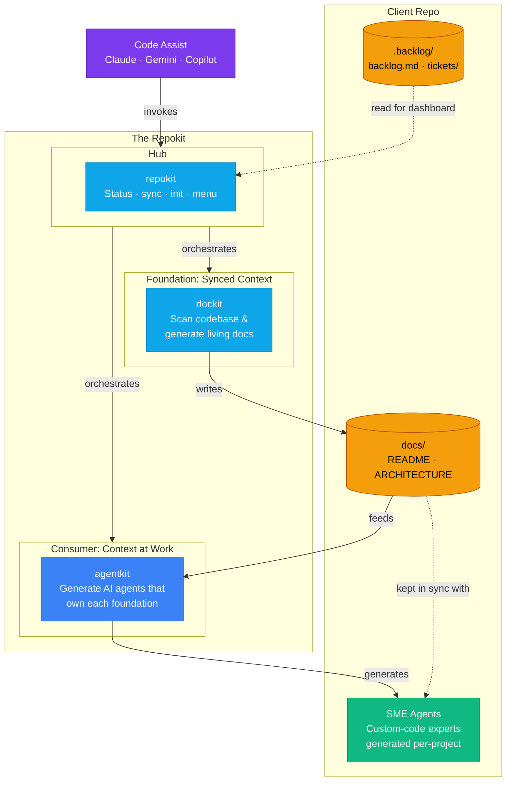
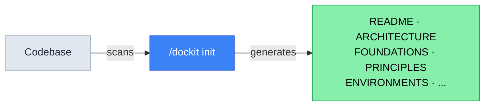
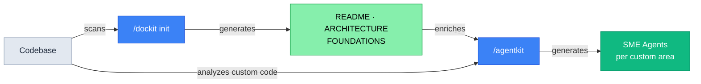
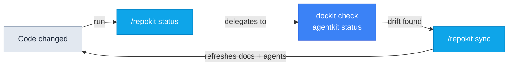

# repokit

**Keep your project's context in sync, then put it to work.**

Repokit treats your codebase's documentation as living context. `dockit` scans the project and keeps docs aligned with the code as it changes. `agentkit` then turns that synced context into project-level AI agents — one per foundation — that own their piece of the codebase and stay in sync with the docs that describe it.

- **`dockit`** — the foundation: generates and syncs living documentation, including a `FOUNDATIONS.md` registry of the shared code everything else depends on
- **`agentkit`** — the consumer: reads `FOUNDATIONS.md` and your custom code to generate subject-matter-expert agents

The `/repokit` hub orchestrates the loop with `status`, `sync`, and `init`. Works with **Claude Code**, **Gemini CLI**, and **GitHub Copilot CLI**.

> **Sibling plugin:** ticket creation lives in [tikkit](https://github.com/TheLampshady/tikkit) — `/tik`, `/figtik`, `/stitchtik`, `/modernizer`. Repokit reads `.backlog/backlog.md` for its health dashboard; tikkit writes it. Install both to have findings captured as work items.

## Install

**Claude Code plugin:**
```bash
claude plugin marketplace add TheLampshady/repokit
claude plugin install repokit@repokit-marketplace
```


**Gemini CLI extension:**
```bash
gemini extensions install https://github.com/TheLampshady/repokit
```

**GitHub Copilot CLI plugin:**
```bash
copilot plugin install https://github.com/TheLampshady/repokit
```


### Update

**Claude Code plugin:**
```bash
claude plugin marketplace update repokit-marketplace
```

**Gemini CLI extension:**
```bash
gemini extensions update repokit
```

**GitHub Copilot CLI plugin:**
```bash
copilot plugin update repokit
```

### Un-Install

**Claude Code plugin:**
```bash
claude plugin marketplace remove TheLampshady/repokit
claude plugin uninstall repokit@repokit-marketplace
```

**Gemini CLI extension:**
```bash
gemini extensions uninstall https://github.com/TheLampshady/repokit
```

**GitHub Copilot CLI plugin:**
```bash
copilot plugin uninstall https://github.com/TheLampshady/repokit
```

---

## Tools

### Skills (cross-platform: Claude + Gemini + Copilot)

| Skill | Command | Purpose | Status |
|-------|---------|---------|--------|
| **agentkit** | `/agentkit` | Generate project-level AI agents tailored to your codebase's custom code patterns. Supports Claude, Gemini, and Copilot. | WIP |
| **dockit** | `/dockit` | Generate, sync, check, audit, migrate, and refresh diagrams in project documentation. Scales by project size, auto-detects frameworks. | Ready |
| **repokit** | `/repokit` | Hub — repo health dashboard, post-change sync, project bootstrap. | Ready |

### Agents

Repokit ships **no agents of its own**. Agents are an output of the toolkit, not part of it — `/agentkit` generates them into your project so they describe *your* foundations, not repokit's.

> **Gemini users:** See [Enabling Gemini Subagents](#gemini-subagents) to use agents on Gemini.

---

## Ticket System

Repokit **reads** a shared backlog under `.backlog/` for its health dashboard. It never writes to it:

```
.backlog/
├── backlog.md       ← master checklist, items tagged by source
└── tickets/
    ├── add-tests.md
    └── stale-setup-docs.md
```

Ticket creation comes from [tikkit](https://github.com/TheLampshady/tikkit), which writes `[tik]`, `[figtik]`, `[stitchtik]`, and `[modernizer]` items. `/repokit status` reports whatever it finds there alongside doc and agent drift, so open work and stale context show up in one place. No `.backlog/`? Repokit just omits those rows.

---

## Keeping Docs in Sync

After making code changes, run dockit to check for documentation drift:

- `/repokit:dockit check` — detect stale docs (read-only, exit codes)
- `/repokit:dockit sync` — auto-update stale sections (non-destructive)

Run `check` before releases or PRs. Run `sync` when docs fall behind.

---

## Context7 (Library Documentation)

Repokit's agentkit skill uses [Context7](https://github.com/upstash/context7) to fetch up-to-date framework documentation when analyzing your codebase. No API key required.

**Claude Code & Copilot CLI** — bundled automatically via `.mcp.json`. Context7 starts when the plugin is installed.

**Gemini CLI** — add to your `~/.gemini/settings.json`:

```json
{
  "mcpServers": {
    "context7": {
      "type": "http",
      "url": "https://mcp.context7.com/mcp"
    }
  }
}
```

> For higher rate limits or private repo access, get a free API key at [context7.com/dashboard](https://context7.com/dashboard) and set `CONTEXT7_API_KEY` in your environment.

---

## Gemini Subagents

Repokit agent definitions are compatible with Gemini's experimental subagent system.

**1. Enable subagents** in `.gemini/settings.json` or `~/.gemini/settings.json`:

```json
{
  "experimental": {
    "enableAgents": true
  }
}
```

**2. Copy agent definitions:**

```bash
# Project-level (team-shared)
mkdir -p .gemini/agents
cp agents/*.md .gemini/agents/

# Or user-level (all your projects)
mkdir -p ~/.gemini/agents
cp agents/*.md ~/.gemini/agents/
```

**3. Restart Gemini CLI.**

> Subagents run in YOLO mode — they execute tool calls without per-step confirmation. Review `agents/*.md` before enabling.

---

## Component Diagram


```mermaid
graph TD
    subgraph repokit["The Repokit"]
        direction TB

        subgraph hub["Hub"]
            S_repokit["repokit<br/>Status · sync · init · menu"]
        end

        subgraph foundation["Foundation: Synced Context"]
            S_dockit["dockit<br/>Scan codebase &<br/>generate living docs"]
        end

        subgraph consumers["Consumer: Context at Work"]
            S_agentkit["agentkit<br/>Generate AI agents that<br/>own each foundation"]
        end
    end

    subgraph client_repo["Client Repo"]
        direction TB
        Docs[("docs/<br/>README · ARCHITECTURE")]
        SME["SME Agents<br/>Custom-code experts<br/>generated per-project"]
        Spec[(".backlog/<br/>backlog.md · tickets/")]
    end

    CA["Code Assist<br/>Claude · Gemini · Copilot"]

    CA -->|"invokes"| hub
    hub -->|"orchestrates"| foundation
    hub -->|"orchestrates"| consumers

    S_dockit -->|"writes"| Docs
    Docs -->|"feeds"| S_agentkit

    S_agentkit -->|"generates"| SME
    Docs -.->|"kept in sync with"| SME
    Spec -.->|"read for dashboard"| S_repokit

    classDef skill   fill:#3b82f6,stroke:#1d4ed8,color:#fff
    classDef storage fill:#f59e0b,stroke:#b45309,color:#000
    classDef ai      fill:#7c3aed,stroke:#5b21b6,color:#fff
    classDef found   fill:#0ea5e9,stroke:#0284c7,color:#fff
    classDef sme     fill:#10b981,stroke:#059669,color:#fff

    class S_repokit found
    class S_agentkit skill
    class Docs,Spec storage
    class CA ai
    class SME sme
    class S_dockit found
```

> The architecture is one foundation feeding one consumer. dockit produces synced context; agentkit turns it into agents that own the code it describes. The hub keeps both current and reports when either drifts.

> **Claude Code:** skills invoked as `/repokit:skill-name` · **Gemini CLI / Copilot CLI:** invoked as `/skill-name`, agents require [opt-in setup](#gemini-subagents)

### Scenario Flows

#### Documentation on Demand


```mermaid
graph LR
    Codebase["Codebase"]
    Dockit["/dockit init"]
    Output["README · ARCHITECTURE<br/>FOUNDATIONS · PRINCIPLES<br/>ENVIRONMENTS · ..."]

    Codebase -->|"scans"| Dockit -->|"generates"| Output

    classDef skill fill:#3b82f6,stroke:#1d4ed8,color:#fff
    classDef output fill:#86efac,stroke:#16a34a,color:#000
    class Dockit skill
    class Output output
    style Codebase fill:#e2e8f0,stroke:#94a3b8,color:#1e293b
```

> Scans the codebase and generates docs from what's there — including a `FOUNDATIONS.md` catalog of shared/foundational code, detected by fan-in × cross-feature × stability scoring. Run once to bootstrap, then `/dockit sync` to keep everything current.

#### Generate SME Agents


```mermaid
graph LR
    Codebase["Codebase"]
    Dockit["/dockit init"]
    Docs["README · ARCHITECTURE<br/>FOUNDATIONS"]
    Agentkit["/agentkit"]
    Agents["SME Agents<br/>per custom area"]

    Codebase -->|"scans"| Dockit -->|"generates"| Docs
    Docs -->|"enriches"| Agentkit
    Codebase -->|"analyzes custom code"| Agentkit -->|"generates"| Agents

    classDef skill fill:#3b82f6,stroke:#1d4ed8,color:#fff
    classDef sme fill:#10b981,stroke:#059669,color:#fff
    classDef output fill:#86efac,stroke:#16a34a,color:#000
    class Dockit,Agentkit skill
    class Agents sme
    class Docs output
    style Codebase fill:#e2e8f0,stroke:#94a3b8,color:#1e293b
```

> Recommended flow: `/dockit init` first to generate project docs (including `FOUNDATIONS.md` — the catalog of shared/foundational code), then `/agentkit` uses those docs as architecture context when building agents. Agents are scaled to project size and generated for Claude/Gemini/Copilot.

#### Keeping Context in Sync


```mermaid
graph LR
    Changed["Code changed"]
    Status["/repokit status"]
    Check["dockit check<br/>agentkit status"]
    Sync["/repokit sync"]

    Changed -->|"run"| Status -->|"delegates to"| Check -->|"drift found"| Sync
    Sync -->|"refreshes docs + agents"| Changed

    classDef skill fill:#3b82f6,stroke:#1d4ed8,color:#fff
    classDef found fill:#0ea5e9,stroke:#0284c7,color:#fff
    class Status,Sync found
    class Check skill
    style Changed fill:#e2e8f0,stroke:#94a3b8,color:#1e293b
```

> Docs drift from code, and agents drift from docs. `status` delegates both checks to the tools that own them — `dockit check` for doc drift, `agentkit status` for agent drift — then `sync` reconciles both in one pass. The hub orchestrates; it never reimplements either check.
>
> `status` also checks the **context handoff**: whether your `CLAUDE.md` / `AGENTS.md` / `GEMINI.md` / `copilot-instructions.md` actually references `docs/FOUNDATIONS.md`. That file is loaded on every turn; the foundation registry isn't. Without the pointer, agents re-derive your architecture from scratch each time. `status` reports the gap; `/repokit init` offers to append a two-line section — always asking first, always appending, never rewriting.

---

## Structure

```
repokit/
├── skills/                  ← cross-platform skills (Claude + Gemini + Copilot)
│   ├── agentkit/
│   ├── dockit/
│   └── repokit/
├── .claude/agents/          ← internal dev tools (component-reviewer)
├── .claude-plugin/          ← Claude plugin + marketplace metadata
├── policies/                ← Gemini policy engine rules
├── CLAUDE.md                ← Claude context
├── GEMINI.md                ← Gemini context + subagent setup
└── gemini-extension.json    ← Gemini extension manifest
```

---

## Policies

The Gemini extension includes security policies (`policies/policies.toml`):

- Requires confirmation before `rm -rf` commands
- Blocks grep searches for sensitive files (`.env`, `id_rsa`, `passwd`)
- Validates file paths on write operations

---

## Report an Issue

Found a bug or unexpected behavior with a skill or agent? [Open an issue](https://github.com/TheLampshady/repokit/issues/new?template=ai-skills.yml).

Include which component (skill/agent), AI platform, and what you asked vs. what happened.

---
