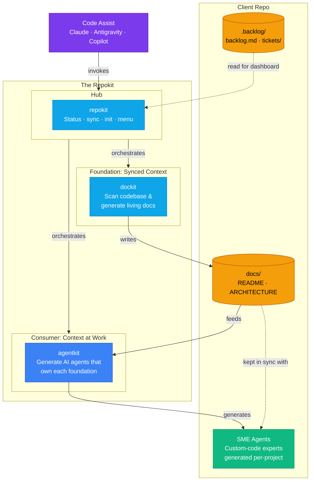
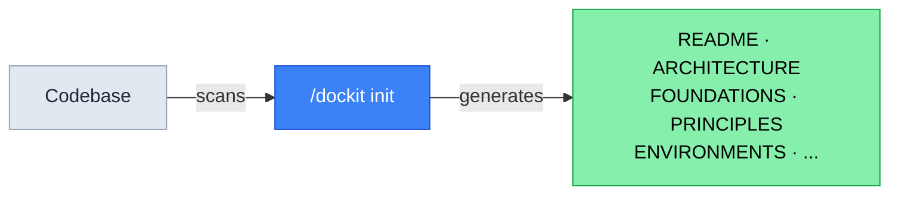
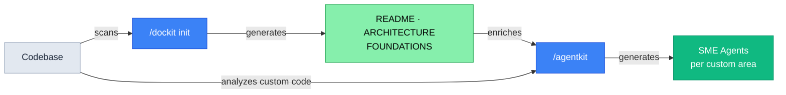
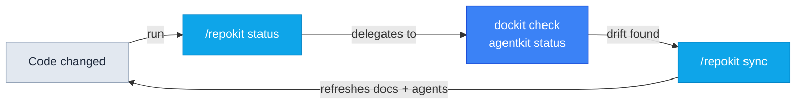

# repokit

**Keep your project's context in sync, then put it to work.**

Repokit treats your codebase's documentation as living context. `dockit` scans the project and keeps docs aligned with the code as it changes. `agentkit` then turns that synced context into project-level AI agents — one per foundation — that own their piece of the codebase and stay in sync with the docs that describe it.

- **`dockit`** — the foundation: generates and syncs living documentation, including a `FOUNDATIONS.md` registry of the shared code everything else depends on
- **`agentkit`** — the consumer: reads `FOUNDATIONS.md` and your custom code to generate subject-matter-expert agents for Claude, Antigravity, and Copilot

The `/repokit` hub orchestrates the loop with `status`, `sync`, and `init`. Works with **Claude Code**, **Antigravity**, and **GitHub Copilot CLI**.

> **Sibling plugin:** ticket creation lives in [tikkit](https://github.com/TheLampshady/tikkit) — `/tik`, `/figtik`, `/stitchtik`, `/modernizer`. Repokit reads `.backlog/backlog.md` for its health dashboard; tikkit writes it. Install both to have findings captured as work items.

## Install

**Claude Code plugin:**
```bash
claude plugin marketplace add TheLampshady/repokit
claude plugin install repokit@repokit-marketplace
```


**Antigravity CLI** (`agy`) — has a real install command:
```bash
git clone https://github.com/TheLampshady/repokit
agy plugin install ./repokit
agy plugin list                    # verify
```

**Antigravity IDE** — installation is folder placement; there's no registry:
```bash
# Workspace-level (this project only)
git clone https://github.com/TheLampshady/repokit .agents/plugins/repokit

# Or global (all workspaces)
git clone https://github.com/TheLampshady/repokit ~/.gemini/config/plugins/repokit
```

> The IDE and CLI are **separate products** (IDE v2.x, CLI `agy` v1.x) with separate plugin directories. The plugin contents are identical — same `plugin.json`, `skills/`, `rules/`, `mcp_config.json` — so one clone serves both, but each needs its own install step.

**GitHub Copilot CLI plugin:**
```bash
copilot plugin install https://github.com/TheLampshady/repokit
```

<details>
<summary>Gemini CLI extension (legacy — retired 2026-06-18)</summary>

```bash
gemini extensions install https://github.com/TheLampshady/repokit
```

Gemini CLI stopped serving Pro/Ultra/free tiers on 2026-06-18. Still works with a Code Assist Standard/Enterprise license.
</details>


### Update

**Claude Code plugin:**
```bash
claude plugin marketplace update repokit-marketplace
```

**Antigravity CLI:**
```bash
git -C ./repokit pull && agy plugin install ./repokit
```

**Antigravity IDE:**
```bash
git -C .agents/plugins/repokit pull          # or ~/.gemini/config/plugins/repokit
```

**GitHub Copilot CLI plugin:**
```bash
copilot plugin update repokit
```

<details>
<summary>Gemini CLI extension (legacy)</summary>

```bash
gemini extensions update repokit
```
</details>

### Un-Install

**Claude Code plugin:**
```bash
claude plugin marketplace remove TheLampshady/repokit
claude plugin uninstall repokit@repokit-marketplace
```

**Antigravity CLI:**
```bash
agy plugin uninstall repokit                  # or `agy plugin disable repokit` to keep it staged
```

**Antigravity IDE:**
```bash
rm -rf .agents/plugins/repokit                # or ~/.gemini/config/plugins/repokit
```

**GitHub Copilot CLI plugin:**
```bash
copilot plugin uninstall https://github.com/TheLampshady/repokit
```

<details>
<summary>Gemini CLI extension (legacy)</summary>

```bash
gemini extensions uninstall https://github.com/TheLampshady/repokit
```
</details>

---

## Tools

### Skills (cross-platform: Claude + Antigravity + Copilot)

| Skill | Command | Purpose | Status |
|-------|---------|---------|--------|
| **agentkit** | `/agentkit` | Generate project-level AI agents tailored to your codebase's custom code patterns. Supports Claude, Antigravity, and Copilot. | WIP |
| **dockit** | `/dockit` | Generate, sync, check, migrate, and refresh diagrams in project documentation. `sync --deep` runs a whole-repo scan. Scales by project size, auto-detects frameworks. | Ready |
| **repokit** | `/repokit` | Hub — repo health dashboard, post-change sync, project bootstrap. | Ready |

### Agents

Repokit ships **no agents of its own**. Agents are an output of the toolkit, not part of it — `/agentkit` generates them into your project so they describe *your* foundations, not repokit's.

> **Antigravity users:** See [Antigravity Subagents](#antigravity-subagents) for how generated agents are discovered.

---

## Ticket System

Repokit **reads** a shared backlog under `.backlog/` for its health dashboard. It never writes to it:

```
.backlog/
├── backlog.md       ← master checklist, items tagged by source
└── tickets/
    ├── add-tests.md
    └── stale-setup-docs.md
```

Ticket creation comes from [tikkit](https://github.com/TheLampshady/tikkit), which writes `[tik]`, `[figtik]`, `[stitchtik]`, and `[modernizer]` items. `/repokit status` reports whatever it finds there alongside doc and agent drift, so open work and stale context show up in one place. No `.backlog/`? Repokit just omits those rows.

---

## Keeping Docs in Sync

After making code changes, run dockit to check for documentation drift:

- `/repokit:dockit check` — detect stale docs (read-only, exit codes)
- `/repokit:dockit sync` — auto-update stale sections (non-destructive)

Run `check` before releases or PRs. Run `sync` when docs fall behind.

---

## Context7 (Library Documentation)

Repokit's agentkit skill uses [Context7](https://github.com/upstash/context7) to fetch up-to-date framework documentation when analyzing your codebase. No API key required.

**Claude Code & Copilot CLI** — bundled automatically via `.mcp.json`. Context7 starts when the plugin is installed.

**Antigravity (IDE and CLI)** — bundled via `mcp_config.json` at the plugin root, no setup needed.

**Gemini CLI (legacy)** — add to your `~/.gemini/settings.json`:

```json
{
  "mcpServers": {
    "context7": {
      "type": "http",
      "url": "https://mcp.context7.com/mcp"
    }
  }
}
```

> For higher rate limits or private repo access, get a free API key at [context7.com/dashboard](https://context7.com/dashboard) and set `CONTEXT7_API_KEY` in your environment.

---

## Antigravity Subagents

Subagents are a standard Antigravity feature — no experimental flag, nothing to copy. Run `/agentkit` and it writes Antigravity-format agents straight to `.agents/agents/` in your workspace, then `/agents` lists them.

That workspace path is the same for the IDE and the CLI, so generated agents work on both without a per-product step.

**1. Run `/agentkit`** — it detects Antigravity and writes to `.agents/agents/<name>.md`.

**2. Run `/agents`** in Antigravity CLI to confirm they're discovered.

Generated agents get `commandExecutionPolicy: sandbox`, so protected operations raise an inline approval prompt (`a` to approve, `d` to deny) instead of running unattended. They also get `mainAgent: false`, which keeps them out of the primary-agent picker while leaving them delegable.

> **Migrating from Gemini CLI?** Antigravity discovers subagents at `.agents/agents/`, **not** `.gemini/agents/`. Agents left in the old location are silently ignored — re-run `/agentkit` rather than moving files by hand, because the frontmatter schema changed too (`tools` is now an enforced allowlist using Antigravity tool names, and `temperature` / `max_turns` / `timeout_mins` are gone).

---

## Component Diagram


```mermaid
graph TD
    subgraph repokit["The Repokit"]
        direction TB

        subgraph hub["Hub"]
            S_repokit["repokit<br/>Status · sync · init · menu"]
        end

        subgraph foundation["Foundation: Synced Context"]
            S_dockit["dockit<br/>Scan codebase &<br/>generate living docs"]
        end

        subgraph consumers["Consumer: Context at Work"]
            S_agentkit["agentkit<br/>Generate AI agents that<br/>own each foundation"]
        end
    end

    subgraph client_repo["Client Repo"]
        direction TB
        Docs[("docs/<br/>README · ARCHITECTURE")]
        SME["SME Agents<br/>Custom-code experts<br/>generated per-project"]
        Spec[(".backlog/<br/>backlog.md · tickets/")]
    end

    CA["Code Assist<br/>Claude · Antigravity · Copilot"]

    CA -->|"invokes"| hub
    hub -->|"orchestrates"| foundation
    hub -->|"orchestrates"| consumers

    S_dockit -->|"writes"| Docs
    Docs -->|"feeds"| S_agentkit

    S_agentkit -->|"generates"| SME
    Docs -.->|"kept in sync with"| SME
    Spec -.->|"read for dashboard"| S_repokit

    classDef skill   fill:#3b82f6,stroke:#1d4ed8,color:#fff
    classDef storage fill:#f59e0b,stroke:#b45309,color:#000
    classDef ai      fill:#7c3aed,stroke:#5b21b6,color:#fff
    classDef found   fill:#0ea5e9,stroke:#0284c7,color:#fff
    classDef sme     fill:#10b981,stroke:#059669,color:#fff

    class S_repokit found
    class S_agentkit skill
    class Docs,Spec storage
    class CA ai
    class SME sme
    class S_dockit found
```

> The architecture is one foundation feeding one consumer. dockit produces synced context; agentkit turns it into agents that own the code it describes. The hub keeps both current and reports when either drifts.

> **Claude Code:** skills invoked as `/repokit:skill-name` · **Copilot CLI:** `/skill-name` · **Antigravity IDE:** skills auto-activate from their description (mention one by name to force it) · **Antigravity CLI:** skills compile into slash commands. See [Antigravity Subagents](#antigravity-subagents).

### Scenario Flows

#### Documentation on Demand


```mermaid
graph LR
    Codebase["Codebase"]
    Dockit["/dockit init"]
    Output["README · ARCHITECTURE<br/>FOUNDATIONS · PRINCIPLES<br/>ENVIRONMENTS · ..."]

    Codebase -->|"scans"| Dockit -->|"generates"| Output

    classDef skill fill:#3b82f6,stroke:#1d4ed8,color:#fff
    classDef output fill:#86efac,stroke:#16a34a,color:#000
    class Dockit skill
    class Output output
    style Codebase fill:#e2e8f0,stroke:#94a3b8,color:#1e293b
```

> Scans the codebase and generates docs from what's there — including a `FOUNDATIONS.md` catalog of shared/foundational code, detected by fan-in × cross-feature × stability scoring. Run once to bootstrap, then `/dockit sync` to keep everything current.

#### Generate SME Agents


```mermaid
graph LR
    Codebase["Codebase"]
    Dockit["/dockit init"]
    Docs["README · ARCHITECTURE<br/>FOUNDATIONS"]
    Agentkit["/agentkit"]
    Agents["SME Agents<br/>per custom area"]

    Codebase -->|"scans"| Dockit -->|"generates"| Docs
    Docs -->|"enriches"| Agentkit
    Codebase -->|"analyzes custom code"| Agentkit -->|"generates"| Agents

    classDef skill fill:#3b82f6,stroke:#1d4ed8,color:#fff
    classDef sme fill:#10b981,stroke:#059669,color:#fff
    classDef output fill:#86efac,stroke:#16a34a,color:#000
    class Dockit,Agentkit skill
    class Agents sme
    class Docs output
    style Codebase fill:#e2e8f0,stroke:#94a3b8,color:#1e293b
```

> Recommended flow: `/dockit init` first to generate project docs (including `FOUNDATIONS.md` — the catalog of shared/foundational code), then `/agentkit` uses those docs as architecture context when building agents. Agents are scaled to project size and generated for Claude/Antigravity/Copilot.

#### Keeping Context in Sync


```mermaid
graph LR
    Changed["Code changed"]
    Status["/repokit status"]
    Check["dockit check<br/>agentkit status"]
    Sync["/repokit sync"]

    Changed -->|"run"| Status -->|"delegates to"| Check -->|"drift found"| Sync
    Sync -->|"refreshes docs + agents"| Changed

    classDef skill fill:#3b82f6,stroke:#1d4ed8,color:#fff
    classDef found fill:#0ea5e9,stroke:#0284c7,color:#fff
    class Status,Sync found
    class Check skill
    style Changed fill:#e2e8f0,stroke:#94a3b8,color:#1e293b
```

> Docs drift from code, and agents drift from docs. `status` delegates both checks to the tools that own them — `dockit check` for doc drift, `agentkit status` for agent drift — then `sync` reconciles both in one pass. The hub orchestrates; it never reimplements either check.
>
> `status` also checks the **context handoff**: whether your `CLAUDE.md` / `AGENTS.md` / `GEMINI.md` / `copilot-instructions.md` actually references `docs/FOUNDATIONS.md`. That file is loaded on every turn; the foundation registry isn't. Without the pointer, agents re-derive your architecture from scratch each time. `status` reports the gap; `/repokit init` offers to append a two-line section — always asking first, always appending, never rewriting.

---

## Structure

```
repokit/
├── skills/                  ← cross-platform skills (Claude + Antigravity + Copilot)
│   ├── agentkit/
│   ├── dockit/
│   └── repokit/
├── .claude/agents/          ← internal dev tools (component-reviewer)
├── .claude-plugin/          ← Claude plugin + marketplace metadata
├── plugin.json              ← Antigravity plugin manifest
├── mcp_config.json          ← Antigravity MCP config
├── rules/                   ← Antigravity rules (markdown)
├── policies/                ← Gemini CLI policy engine rules (legacy)
├── CLAUDE.md                ← Claude context
├── GEMINI.md                ← workspace context (Antigravity + Gemini CLI)
└── gemini-extension.json    ← Gemini CLI extension manifest (legacy)
```

---

## Policies

Two parallel sets. `rules/*.md` for Antigravity (markdown guidance) and `policies/policies.toml` for Gemini CLI (a policy engine that can hard-deny a call). They cover the same ground but are **not** equal in strength — a rule is instruction the model may follow; a policy is enforcement. Both cover:

- Requires confirmation before `rm -rf` commands
- Blocks grep searches for sensitive files (`.env`, `id_rsa`, `passwd`)
- Validates file paths on write operations

---

## Report an Issue

Found a bug or unexpected behavior with a skill or agent? [Open an issue](https://github.com/TheLampshady/repokit/issues/new?template=ai-skills.yml).

Include which component (skill/agent), AI platform, and what you asked vs. what happened.

---
