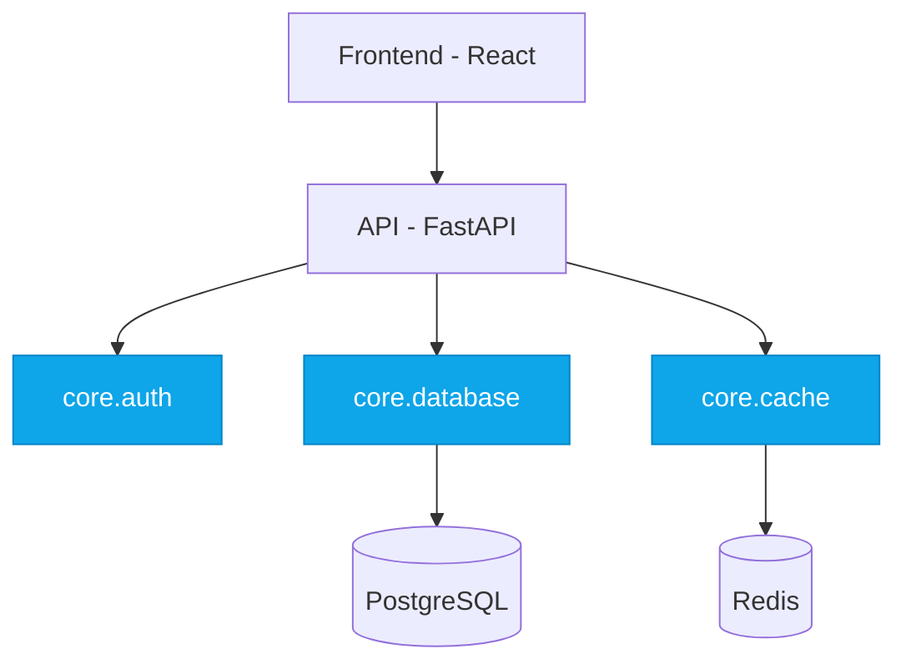
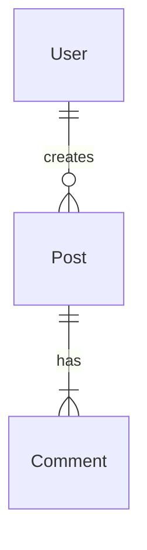
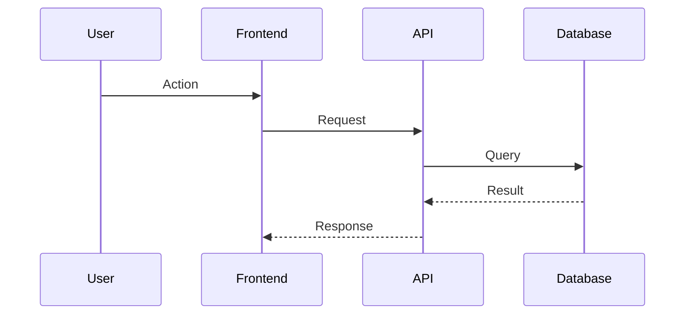
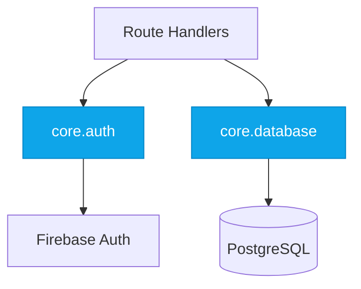

# Diagrams

Mermaid diagram standards for architecture and cloud documentation.

## Overview

| Doc | Diagram Types |
|-----|---------------|
| ARCHITECTURE.md | flowchart, erDiagram, sequenceDiagram |
| CLOUD.md | architecture-beta |

---

## ARCHITECTURE.md Diagrams

### 1. Architecture Flowchart

Shows system components and data flow.



**Include:** frontend, backend, database, external services, data flow

**Foundation styling:** when a node represents a row in `FOUNDATIONS.md`, mark it with `:::foundation` and add a `classDef foundation fill:#0ea5e9,stroke:#0284c7,color:#fff` line at the bottom of the diagram. This makes the diagram self-document which boxes are catalogued reusable building blocks. See [Foundation Annotation](#foundation-annotation) below.

### 2. Data Model ERD

Shows entities and relationships.



**Include:** entities, relationships, key fields

### 3. Request Sequence

Shows typical user flows and interactions.



**Include:** typical user flow, key interactions

---

## CLOUD.md Diagrams

Use `architecture-beta` diagram type (Mermaid v11.1+) for cloud infrastructure. This provides purpose-built primitives for infrastructure visualization.

### 1. Infrastructure Diagram

Shows cloud services and their connections.


**Include:** VPCs, compute services, managed services, data stores, message queues

### 2. CI/CD Pipeline Diagram

Shows the deployment pipeline.


**Include:** source control, build system, artifact storage, deployment targets

---

## architecture-beta Syntax

| Construct | Purpose | Example |
|-----------|---------|---------|
| `group name(icon)[Label]` | Logical grouping (VPC, region) | `group vpc(cloud)[GCP VPC]` |
| `service name(icon)[Label]` | Service node | `service gke(logos:google-cloud)[GKE]` |
| `in groupname` | Place service in group | `service db(database)[CloudSQL] in vpc` |
| `node:SIDE -- SIDE:node` | Directional edge (L/R/T/B) | `gke:R -- L:pubsub` |
| `junction` | 4-way routing node | For complex topologies |

---

## Icon Packs

architecture-beta supports Iconify integration (200k+ icons):

| Pack | Use For | Example |
|------|---------|---------|
| `logos:google-cloud` | GCP services | `logos:google-cloud` |
| `logos:github` | GitHub | `logos:github` |
| `logos:docker` | Docker/containers | `logos:docker` |
| `database` | Generic database | `database` |
| `server` | Generic server | `server` |
| `cloud` | Generic cloud | `cloud` |

**Note**: GCP icon coverage in Iconify is limited. Use generic icons (`cloud`, `database`, `server`) when specific service icons unavailable.

---

## Diagram Rules

1. **No parentheses in mermaid node labels** - Use square brackets
2. **Keep focused and readable** - Don't overcrowd
3. **Label components clearly** - Use descriptive names
4. **Use architecture-beta for infrastructure** - In CLOUD.md
5. **Use flowchart/sequence/ERD for applications** - In ARCHITECTURE.md
6. **Edge directions** - L (left), R (right), T (top), B (bottom)
7. **Annotate foundations** - Nodes that represent a row in `FOUNDATIONS.md` use the `foundation` class (see below)

---

## Foundation Annotation

When a flowchart node represents a foundation catalogued in `FOUNDATIONS.md`, mark it visually so the diagram self-documents which boxes are reusable building blocks.

### Convention

Use a single `classDef` (consistent across every dockit-generated diagram) plus the `:::foundation` shorthand on each foundation node:



| Style property | Value | Why |
|----------------|-------|-----|
| `fill` | `#0ea5e9` (sky-500) | Distinct from the default fill so foundations are immediately visible |
| `stroke` | `#0284c7` (sky-600) | Slightly darker shade of the same hue for outline |
| `color` | `#fff` | White text for contrast on the saturated fill |

This is the same palette repokit's own component diagram uses for `S_dockit` (the foundation skill) — keep it consistent.

### When to annotate

- **Always** when a node directly represents a foundation row (e.g. `core.database`, `core.auth`).
- **Don't** annotate consumers, external services, datastores, or non-foundation services. The whole point is to make foundations stand out.
- **Don't** annotate foundations in ERD or sequence diagrams — these diagram types don't take well to per-node styling. Flowcharts only.

### Naming nodes

Prefix foundation node IDs with `F_` so they're easy to find when editing or re-styling later:

```
F_DB[core.database]:::foundation
F_Auth[core.auth]:::foundation
F_Cache[core.cache]:::foundation
```

The label inside the brackets matches the foundation's `name` field in the catalog.

### Sync behaviour

When `dockit sync` regenerates diagrams (`/dockit diagrams` or sync detecting architecture changes), it re-emits the `classDef` and re-applies `:::foundation` to any node whose label matches a current `FOUNDATIONS.md` row name. Demoted foundations (now pretenders) lose the annotation; new foundations gain it.

---

## When to Generate Diagrams

| Condition | Action |
|-----------|--------|
| `init` mode | Generate all relevant diagrams |
| `sync` mode + architecture changes | Regenerate diagrams |
| `diagrams` mode | Generate/update diagrams only |
| No services detected | Skip infrastructure diagram |
| No data models | Skip ERD |
