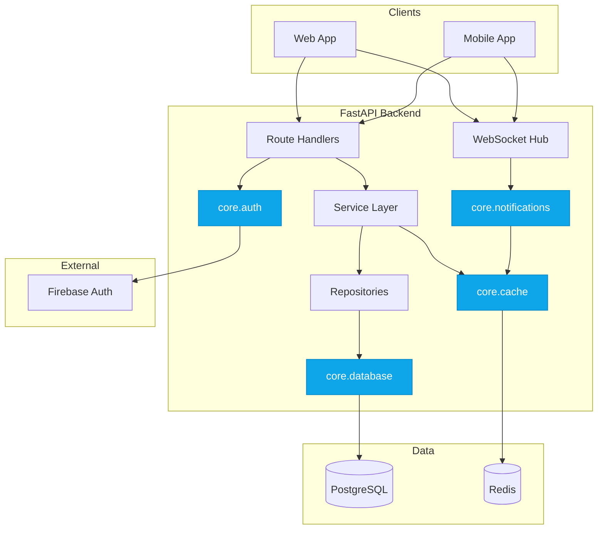
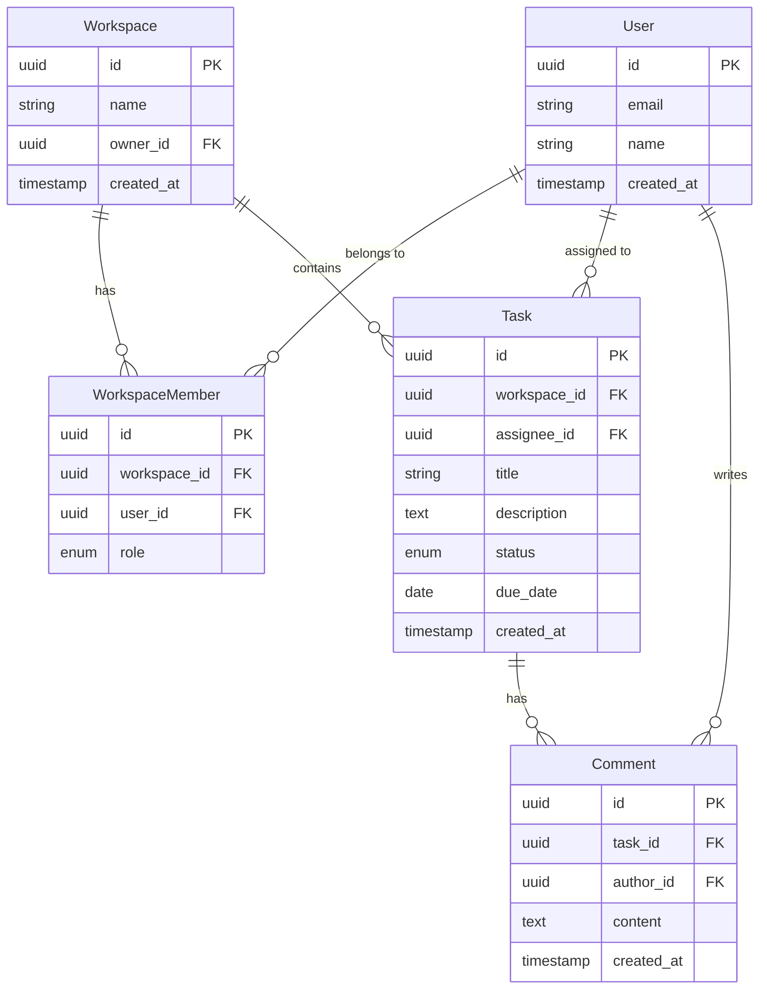
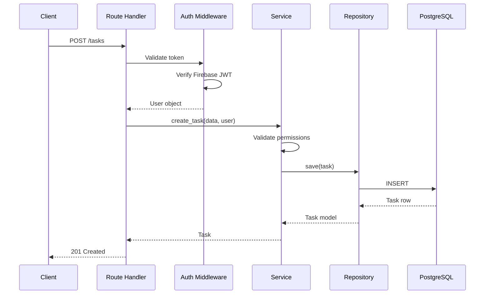

# Architecture

System design, data models, and technical decisions for the Task Manager API.

---

## Overview

FastAPI backend with PostgreSQL for persistence, Redis for caching and real-time features, and Firebase for authentication. Designed for horizontal scaling with stateless API instances.

## System Diagram



> Boxes styled blue are **foundations** — shared, reusable code catalogued in [FOUNDATIONS.md](./FOUNDATIONS.md). Same convention used across all dockit-generated diagrams.

---

## Application Structure

| Directory | Purpose |
|-----------|---------|
| `app/` | Application root |
| `app/api/` | Route handlers, organized by resource |
| `app/api/routes/` | Individual route modules (tasks, workspaces, users) |
| `app/core/` | Configuration, database, auth, cache |
| `app/models/` | SQLAlchemy ORM models |
| `app/schemas/` | Pydantic request/response models |
| `app/services/` | Business logic layer |
| `app/repositories/` | Data access layer |
| `tests/` | Test suite |

---

## Data Model



---

## Key Modules

### Core (`app/core/`)

`app/core/` is the **foundation layer** — shared, reusable code with high fan-in across features. The full catalog (with per-foundation API, invariants, consumers, and refactor triggers) lives in [FOUNDATIONS.md](./FOUNDATIONS.md).

System-level breakdown:

| Module | Purpose |
|--------|---------|
| `config.py` | Settings from environment variables (configuration, not a foundation) |
| Foundations (database, auth, cache, notifications) | See [FOUNDATIONS.md](./FOUNDATIONS.md) |

### Services (`app/services/`)

| Service | Responsibility |
|---------|----------------|
| `TaskService` | Task CRUD, assignment, status transitions |
| `WorkspaceService` | Workspace management, member invites |
| `NotificationService` | Real-time updates via WebSocket |

---

## Request Flow



---

## API

REST API for task management. All endpoints require authentication via Firebase JWT unless noted.

### Base URLs

| Environment | URL |
|-------------|-----|
| Local | `http://localhost:8000` |
| Staging | `https://api-staging.taskmanager.dev` |
| Production | `https://api.taskmanager.dev` |

### Authentication

All requests require a Bearer token from Firebase Auth:

```bash
curl -H "Authorization: Bearer $TOKEN" https://api.taskmanager.dev/tasks
```

### Endpoints

| Method | Endpoint | Description | Auth |
|--------|----------|-------------|------|
| GET | `/tasks` | List tasks in workspace | Required |
| POST | `/tasks` | Create new task | Required |
| GET | `/tasks/{id}` | Get task details | Required |
| PATCH | `/tasks/{id}` | Update task | Required |
| DELETE | `/tasks/{id}` | Delete task | Required |
| GET | `/workspaces` | List user's workspaces | Required |
| POST | `/workspaces` | Create workspace | Required |
| POST | `/workspaces/{id}/invite` | Invite member | Required (Owner) |
| GET | `/users/me` | Current user profile | Required |
| GET | `/health` | Health check | None |

### Error Codes

| Code | Meaning | Common Cause |
|------|---------|--------------|
| 400 | Bad Request | Invalid input or missing required fields |
| 401 | Unauthorized | Missing or expired token |
| 403 | Forbidden | Not a workspace member or insufficient role |
| 404 | Not Found | Task or workspace doesn't exist |
| 409 | Conflict | Duplicate workspace name |
| 500 | Server Error | Internal error—check logs |

### Rate Limits

- 100 requests/minute per user
- 1000 requests/minute per workspace
- Headers: `X-RateLimit-Remaining`, `X-RateLimit-Reset`

---

## External Integrations

| Integration | Purpose | Auth Method |
|-------------|---------|-------------|
| Firebase Auth | User authentication | Service account |
| PostgreSQL | Data persistence | Connection string |
| Redis | Caching, pub/sub | Connection string |

---

## ⚠️ Limitations

**What this API doesn't do:**

- **Bulk operations** — Each task must be created/updated individually
- **Webhooks** — No outbound event notifications (planned for v2)
- **File attachments** — Tasks are text-only
- **Offline sync** — Clients must handle their own offline state

---

## Design Decisions

| Decision | Choice | Rationale |
|----------|--------|-----------|
| Layered architecture | Routes → Services → Repos | Separation of concerns, testability |
| Async SQLAlchemy | SQLAlchemy 2.0 async | Non-blocking database operations |
| UUID primary keys | UUIDs over integers | No sequential enumeration, distributed generation |
| Soft deletes | `deleted_at` column | Audit trail, recovery |

---

## Related Documentation

- [README.md](../README.md) - Project overview
- [PRINCIPLES.md](./PRINCIPLES.md) - Patterns and conventions
- [ENVIRONMENTS.md](./ENVIRONMENTS.md) - Configuration
